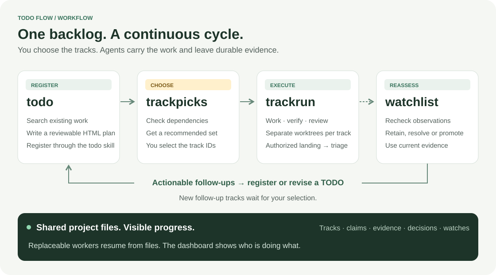

# TODO Flow

**仕事を選ぶ。その先はエージェントが進める。**

選択した TODO を並列作業、独立レビュー、検証済みの成果へつなげます。セッションが終わっても残るファイルと、誰が何をしているかが分かるダッシュボードを備えています。

[English](README.md) · [한국어](README.ko.md) · [日本語](README.ja.md) · [简体中文](README.zh-CN.md)

[インストール](AGENT_INSTALL.ja.md) · [運用](OPERATIONS.ja.md) · [更新](UPDATES.ja.md) · [デモ](DEMO.ja.md)

[始める](#quick-start) · [動作を見る](#see-it-in-action) · [エージェント向け](#for-agents) · [運用](OPERATIONS.ja.md)

[](LICENSE) [](#current-scope) [](pyproject.toml)

<!-- translation-source: README.md; source-sha256: 73d1b8c23f2e72243113043a08f4d62c9c032aba6e4932278bc33a73d22c087f; status: translated -->

## 37秒で見る TODO Flow

https://github.com/user-attachments/assets/8b5acf19-292a-4205-aef1-f48b75305327

*地下鉄路線図風のアニメーションで、トラックの選択、並列エージェント、セッションの引き継ぎ、検証、レビュー、統合を紹介します。*

## 開発活動は最大33倍に


**登録。選択。実行。** 方向を決めるのはユーザーです。交代可能なエージェントが調査、実装、検証、レビューを進め、承認されている場合は統合と triage も行います。

<sub>匿名化した前身ワークフローでは、1日当たりのコミット数が2026年1月の9.3件から9月の316.3件（9月1〜23日）に増加しました。これはコミット活動の値であり、労働生産性の実測倍率や、このパッケージのベンチマークではありません。</sub>

<details>
<summary>1〜9月の推移と測定上の注記</summary>


調整後の1日当たりのソース変更量は**6月から9月に4.52倍**、記録された1日当たりの完了への遷移数は**7月から9月に2.30倍**になりました。指標ごとに示す結果は異なります。1月から9月のソース変更量は1.09倍で、9月の完了への遷移数は8月を下回りました。


[測定方法と月別数値](assets/metrics/README.md) · [集計 JSON](assets/metrics/measurements.json) · [CSV](assets/metrics/monthly.csv)。前身の運用で得られた観測値であり、因果関係を調べる対照実験ではありません。個人やプロジェクトを特定できる元資料は公開していません。

</details>

## ワークフローの循環



**`todo` → `trackpicks` → `trackrun` → `watchlist` → `todo`。** レビュー可能な計画を登録し、仕事を選び、選択したトラックを実行して、注意が必要な事項を再評価します。ダッシュボードで直接トラックを選択することもできます。チェックボックスが有効になるのは、新しい実行リクエストを受け付けられるトラックだけです。**Requested**、**Paused**、**Pause requested** のトラックは再選択できません。タイトルを開いて詳細を確認し、一時停止中の作業はそこで **Resume** を使って再開します。`trackpicks` は仕事を推薦しますが、ワーカーは起動しません。

`trackrun` は既定でレビューまで進んで停止します。統合が承認されていれば、統合と triage まで続き、そのトラックの未解決 Watch も再評価します。明示的に再評価するには `watchlist` を使います。実行可能な発見事項は既存または新しい TODO に戻ります。新しい後続トラックはユーザーの選択を待ちます。これらは共有プロジェクト状態への入口であり、すべてのトラックに必須の段階ではありません。

<a id="see-it-in-action"></a>

## 動作を見る

**このリポジトリでも TODO Flow の利用を始めています。** [実際のセットアップ、ダッシュボードの画面、再現可能な設定](examples/self-hosting/README.md)を参照してください。初期スナップショットには登録済みトラックがまだありません。実作業の実行に合わせて結果を記録します。


*合成データであることを明示した実際のダッシュボードの画面です。この UI ツアーは実際のモデル実行を示すものではありません。*

[ダッシュボードの画面](assets/demo/dashboard-en.png) · [韓国語のダッシュボード](assets/demo/dashboard-ko.png) · [デモの再現](DEMO.ja.md) · [計画のプレビュー](assets/demo/track-example.png) · [HTML の例](examples/retry-backoff.html) · [実際の Issue → マージ済み PR](DEMO.ja.md#過去の公開受け入れテストを確認する)

ツアーでは、密度の高い連続した TODO 一覧、`trackrun` 用の選択、現在のワーカーと判断待ち、表現力のあるトラック文書、独立した完了済みアーカイブを紹介します。実行経路全体は[2トラックの手順](DEMO.ja.md#ワークフロー全体を実行する)に従うか、使い捨てプロジェクトで文書化された実際の受け入れテストを実行してください。

## チャットを超えて続く仕事のために

| 必要なこと | TODO Flow が提供するもの |
|---|---|
| 複数のタスクを進める | 選択したトラックは別々の Git worktree で実行され、ワーカーが範囲を限定した作業を担当します。 |
| セッション終了後に復旧する | 文書、claim、結果、質問、後続作業の意図が検索可能なファイルに残ります。 |
| 実行前に計画を確認する | HTML 文書は図、画像、スクリプト、シミュレーションを保持します。Markdown は HTML にレンダリングする必要があります。 |
| 誰が何をしているか把握する | コンパクトなダッシュボードに現在の作業、担当者、待機、証拠を表示します。完了した作業には専用アーカイブがあります。 |
| 証拠とともに成果を届ける | 対象候補そのものの検証、独立したエージェントレビュー、承認済みの統合、統合後の triage を行います。 |

独立した変更がたまったバックログ、複数セッションにまたがる作業、統合前に複数の変更候補を確認する用途に役立ちます。開発ブランチでは、ワーカーにワークスペースと証拠のパスを渡し、ワーカー自身が関連ファイルを検索して読みます。リリースで利用できる機能と残る制約は[現在の範囲](#current-scope)を参照してください。

<a id="quick-start"></a>

## クイックスタート

**プロジェクトの設定時に、英語（`en`）、韓国語（`ko`）、日本語（`ja`）、簡体字中国語（`zh-CN`）を選びます。** ダッシュボードの既定言語と、エージェントの報告・新しいトラック文書に要求する言語を設定します。スキルの指示は英語のままです。ダッシュボードには個人の表示設定として English / 한국어 / 日本語 / 简体中文 の切り替えもあります。

### エージェントに設定を任せる

プロジェクトと最初のタスクを埋めて、コーディングエージェントのセッションに貼り付けてください。

```text
https://github.com/JakeB-5/todo-flow/blob/main/AGENT_INSTALL.ja.md に従い、
/absolute/my-project に TODO Flow をインストールしてください。
言語を指定していなければ en、ko、ja、zh-CN から選ぶよう確認してください。
最初のタスク: [変更内容と期待する結果]。
レビュー可能な HTML TODO を登録し、そのリンクを見せてください。
この依頼を扱うトラックを選択して実行し、実際の結果と次の手順を報告してください。
```

[エージェント向け](#for-agents)にインストールの契約を説明しています。設定だけの依頼は設定後に終了します。上の依頼文には最初の実行も含まれます。

### 手動でインストールする

前提条件は **Python 3.11+、uv、Git、認証済みの Claude または Codex CLI** です。GitHub Issue と PR には、さらに認証済みの `gh` が必要です。公開リリースをインストールします。

```sh
uv tool install https://github.com/JakeB-5/todo-flow/releases/download/v0.0.9/todo_flow-0.0.9-py3-none-any.whl
todo-flow --version
```

[リリースの成果物とチェックサム](https://github.com/JakeB-5/todo-flow/releases/tag/v0.0.9)。CLI と同梱のダッシュボード・スキルが入り、チェックアウトは不要です。ソース開発では、このリポジトリを clone し、`uv sync --frozen` と `uv tool install .` を使います。

**対象プロジェクト**の実際の検証コマンド、ベースブランチ、関連ファイルのパターンを使ってください。以下は、テストスイート、最初の Git コミット、`origin` リモートを持つ既存の Python プロジェクトの例です。

```sh
cd /absolute/my-project
todo-flow init --repo . --base main --worker codex \
  --language en \
  --verify '["python3","-m","unittest","discover","-v"]' \
  --write 'src/*.py' --write 'tests/*.py' \
  --context 'src/*.py' --context 'tests/*.py' --context README.md

todo-flow install-skills --target .agents/skills
todo-flow serve --port 8765
```

ほかの対応言語には `--language ko`、`--language ja`、`--language zh-CN` を使います。省略すると対話型ターミナルでは選択を求め、ターミナルがなければ英語を既定値にします。Claude のセッションでは `.claude/skills` にインストールしてください。スキルは設定した言語を継承します。GitHub Issue と PR を使う場合は `init` に `--github OWNER/REPOSITORY` を追加します。

**http://127.0.0.1:8765** を開きます。エージェントにインストール済みの todo スキルを使うよう依頼し、生成された文書を確認してから実際の ID を選択して実行します。ダッシュボードが開き、登録した文書が表示され、依頼した最初の実行が設定済みエンドポイントに到達したらセットアップ完了です。[詳しい設定と復旧](AGENT_INSTALL.ja.md)を参照してください。

### 別のワークフローと共存する

衝突がなければ、9個すべてのスキル名と既存の呼び出し方は変わりません。Codex には `.agents/skills`、Claude には `.claude/skills` を使います。`todo-flow install-skills --help` で `--alias` を確認してください。古いリリースでは、この機能を含む版への承認済みの更新やソースビルドが必要な場合があります。

別のワークフローが実際に使用している名前だけに alias を使います。以下は `todo`、`track-picks`、`track-run`、`watchlist` が使用済みで、4つの alias は未使用という例です。

```sh
FLOW_STATE=/absolute/my-project/todo-flow-state
FLOW_SKILLS=/absolute/my-project/.claude/skills
todo-flow --state "$FLOW_STATE" install-skills --target "$FLOW_SKILLS" \
  --alias todo=flow-todo --alias track-picks=flow-track-picks \
  --alias track-run=flow-track-run --alias watchlist=flow-watchlist
```

初期化済みの TODO Flow プロジェクトでは既存の STATE を保持します。別のツールが `todo/` を所有している場合は初期化前に別の STATE を選び、先ほどの `init` に `--state "$FLOW_STATE"` を渡します。他のツールの状態に重ねて初期化したり、`--adopt` でそのスキルの所有権を取得したりしないでください。alias が使用済みならスキルのインストール全体が中止されます。未使用の alias または別の対応インストール先を選びます。既存のファイルとリンクは保持され、未使用の役割名は変わりません。

インストール報告の `entrypoints`（正規の役割 → インストール名）、`state`、`language` と、各スキルの `project.json` を確認します。この例では `flow-todo`、`flow-track-picks`、`flow-track-run`、`flow-watchlist` を使うようエージェントに依頼します。使用済みの元の名前は引き続き他のワークフローを呼び出します。`trackrun` と内部の役割名はそのままで、各インストール済みスキルの役割表は実際の TODO Flow の入口を参照します。シェルコマンドは `todo-flow` と `trackrun` のままです。別の STATE には `trackrun --state "$FLOW_STATE" ACTUAL_TRACK_ID` を使います。

更新では保存済みの対応関係を再利用するため、alias の再指定は不要です。

```sh
todo-flow --state "$FLOW_STATE" update-skills --target "$FLOW_SKILLS" --dry-run
# 計画を確認し、競合を解消してから適用します:
todo-flow --state "$FLOW_STATE" update-skills --target "$FLOW_SKILLS"
```

上流ファイルに変更がなければローカル編集は保持されます。両方で変更された場合は更新全体が停止します。インストールの manifest を保持してください。`--recover` と `--rollback BACKUP_ID` は[共存・復旧・ロールバック](AGENT_INSTALL.ja.md)を参照してください。使い捨て環境でのバンドルテストはファイル配置、メタデータ、リンクを検査します。実際の Claude セッションでのスキル検出とモデル呼び出しは別の検査であり、これらのテストでは実行しません。セッションが更新されていなければ、新しいセッションを開くか、インストール済みの `SKILL.md` を明示的に読んでください。

### ワーカーの割り当てを指定する

トラックの `workerPlan` に、役割ごとの `provider`、`model`、推論の `effort`、`basis` を記録します。`trackrun TRACK_ID --worker-mode auto`、`--worker-mode codex-only`、`--worker-mode claude-only` を使います。`--worker-roles FILE.json` では役割の明示的な上書きを指定できます。[選択ガイドと完全な例](skills/todo/worker-routing.md)を参照してください。単一プロバイダーに限定するモードでは、許可された役割選択またはプロジェクトの既定値・プロファイルが必要です。互換性のない推薦は、別のプロバイダーの利用を許可しません。

割り当てのスナップショットは、`--request-only`、ドライバー再起動、一時停止・再開、修復・再試行を通じてリクエストごとに保持されます。割り当てオプションなしで開始を繰り返すと、既存の選択が保持されます。明示的な再選択が適用されるのは将来の試行だけです。プロジェクトの既定値、過去のレシート、起動結果が不確かな処理は変更しません。計画や割り当てオプションがない従来のトラックは、単一またはカスタムのアダプターを引き続き使います。`worker-selection.json` は選択値を記録し、native のレシートはプロバイダーが確認した値を別に記録します。後者は null の場合もあります。登録は役割を推薦するだけで実行しません。トラック直下の `effort` は引き続き作業量の見積もりです。

### ワーカー試行回数の上限を指定する

リクエストに明示的な上限を設ける場合は、`trackrun TRACK_ID --worker-attempt-limit 10` または `todo-flow --state STATE start TRACK_ID --worker-attempt-limit 10` を使います。正の上限は、選択した各トラックのリクエストに個別に適用されます。省略時は既存の無制限方針を維持します。`--max-tasks` の既定値は引き続き100で、1回のドライバー起動で処理するタスク数を制限します。ドライバーを再起動してもリクエストのワーカー上限はリセットされません。

評価、実装、独立レビュー、triage、Watch の各試行は、claim 時に1回分を原子的に確保します。起動前の失敗も含め、失敗・中断した試行も消費回数に残ります。ホストの検証、統合、完了タスクはワーカー試行回数を消費しません。`budgets/` のファイルが上限と累積使用量を保持し、`status`、ドライバー出力、決定、予算イベントに使用量、候補 HEAD、残りのタスクが表示されます。予算による停止でも結果と未完了の義務は保持され、目標の達成を意味しません。

予算による停止から再開するには `todo-flow --state STATE answer DECISION_ID --text 'Approve additional attempts' --additional-worker-attempts 5` を使い、必要に応じて `todo-flow --state STATE run` を再起動します。正の追加回数は、使用量を消去したり保留中の作業を置き換えたりせず、既存の総上限を増やします。通常の回答、`pause`/`resume`、`start`/`trackrun` の繰り返しでは追加試行を許可できません。予算の承認には CLI を使ってください。他の決定には通常のダッシュボード回答を引き続き使えます。

### 任意の検証前チェックを実行する

新しい状態を初期化するとき、既存の `--verify` より前に明示的に選んだ軽量チェックを実行するには、`init` に次の引数を追加します。

```sh
--verify-preflight '[["uv","run","ruff","check","src","tests"],["uv","run","ruff","format","--check","src","tests"]]'
```

これは単独のコマンドではなく引数です。例のツールを事前にインストールするか、プロジェクトで利用できるチェックの argv 配列に置き換えてください。コマンドは候補のワークスペースで順番に実行され、暗黙のシェルは使いません。検証環境と、コマンドごとの `--verify-timeout` を使います。最初の失敗またはタイムアウトで検証を停止します。キャンセルは監視対象のプロセスを停止し、後続コマンドの実行を防ぎます。すべて通過してから、変更されていない完全な検証コマンドが実行されます。事前チェックの成功だけでは、検証成功や統合資格は得られません。

省略または `[]` の指定では既存の実行経路を維持します。検証記録には、試みた各チェックの段階、argv、ログ参照が含まれます。明示的な要件違反は修復作業へ、判定不能な実行は診断へ進みます。順序付きリストは検証の同一性に含まれ、変更すると過去の成功が無効になります。外部のチェックスクリプトなどの関連入力は、後述の `--verify-identity` で宣言してください。既存の状態は `init` で再設定できず、後述の設定移行の制約が同様に適用されます。

### 中間段階の検証チェックを選ぶ

新しい状態では `init` に `--verify-related '[["uv","run","python","-m","unittest","tests.test_calc"]]'` を追加し、例をプロジェクトで使えるチェックに置き換えます。順序付き argv 配列は `verify_related` として保存され、自動的な影響分析は行いません。事前チェックと同じく、既存の状態は `init` では再設定できません。

中間の変更提案では、設定済みの事前チェック後にこれらの関連チェックを実行します。各コマンドは候補ワークスペース、取得済みの検証環境、検証タイムアウトを使い、キャンセルと失敗の扱いも同じです。部分的な成功はフィードバックに限られます。ワーカーの `verify:true`、公開リクエスト、review/land/complete の後続要求では、変更されていない完全な `verify` コマンドが必要です。明示的な検証タスク、復旧した提案、統合検証でも完全な検証が必要です。どちらの経路でも事前チェックを先に実行します。関連チェックは完全な検証のどの部分も置き換えません。

`verify_related` を省略するか `[]` にすると、変更のたびに完全な検証を行う既存の動作を維持します。記録は検証範囲と順序付きの関連チェック方針を検証の同一性に結び付けます。部分的な結果は完全な検証のキャッシュ検索や外部作用のゲートを満たせません。方針変更は過去の証拠を無効にします。関連チェック方針がない場合、対応している同一性が一致する従来の完全検証記録は引き続き有効です。同一性のない記録には新しい検証が必要です。外部の関連チェックスクリプトも `--verify-identity` で宣言してください。実時間の短縮を保証するものではありません。ローカルの回帰 fixture では、中間変更2回と最終候補1回を比較し、最終的な不具合を検出しつつ完全検証の呼び出しを3回から1回に減らしています。

### 検証結果

検証記録は `ok` を保持し、`outcome`（`passed`、`failed`、`inconclusive`）と `reason` を追加します。既存の検証範囲、クリーンな HEAD、入力の同一性、プロセス、独立レビューのゲートを満たしたうえで、`passed` かつ `ok:true` の場合だけ成功の証拠になります。明示的な非成功、キャンセル、不完全な証拠、記録済みチェックの非成功を `ok:true` で覆すことはできません。

検証コマンドは**標準出力の最終行**に、JSON オブジェクトと文字列サフィックス ` TODO_FLOW_RESULT_V1` を付けて結果を報告できます。

```text
{"outcome":"failed","reason":"add(2, 3) returned 6; expected 5"} TODO_FLOW_RESULT_V1
```

行全体を UTF-8 で4096バイト以内に収め、`reason` は空でない文字列にします。その前に通常のログを出力できます。マーカー付きの行が不正なら判定不能です。確認済みの要件違反（`failed`）と環境・チェックの失敗（`inconclusive`）を区別する責任は検証コマンドにあります。ホストは `AssertionError`、インストール診断、その他の例外文から推測しません。失敗の宣言には非ゼロ終了を伴えますが、宣言によってログのレシートが完全になるわけではありません。成功の宣言にも終了コード0、完全な出力、確認済みの正常なプロセス終了が必要です。タイムアウトや残存プロセスは宣言より優先されます。

互換性は明示的に扱います。マーカーなしで終了コード0のコマンドは、既存のすべてのゲートの下で従来の成功動作を維持します。マーカーなしの非ゼロ終了は引き続き `ok:false` ですが、終了コードだけでは要件違反を証明できないため `inconclusive` に分類します。過去の真偽値だけの記録は書き換えません。`ok:true` が利用可能なのは、対応する同一性が一致し、他の既存ゲートも満たす場合だけです。`ok:false` は非成功のままで、明示的な outcome が要件違反を示さない限り、判定不能として表示・処理します。構造化された outcome が欠落または未知の場合、成功を認めません。

明示的な検証タスクでも提案後の検証でも、`failed` は要件の修復へ、`inconclusive` は記録済みの段階・ログ・環境の評価へ進みます。診断では候補を保持し、承認された復旧後に同じ HEAD の検証を要求するか、復旧方法が不明なら具体的な判断を求めます。自動的な依存関係のインストールや推測に基づく製品編集は許可しません。統合検証が判定不能の場合は候補の証拠を保持し、製品の修復を開始せず復旧の判断を求めます。非成功の結果は成功としてキャッシュされないため、製品へのコミットなしでも環境復旧を確認できます。

### 検証入力を宣言する

バージョン `0.0.5` は `init --verify-identity` に対応しています。**新しい状態**では、実際の `init` コマンドに次のような引数を追加します。例のパスは検証コマンドが使用する既存の入力に置き換えてください。

```sh
--verify-identity '{"version":1,"files":["/absolute/verification/verify.py","/absolute/python/bin/python3","uv.lock"],"environment":["PATH","VERIFY_MODE"],"nonce":"baseline-1"}'
```

これは単独のコマンドではなく引数です。`version` は `1` でなければなりません。`files` は個別の通常ファイルの一覧で、ディレクトリや glob は使えません。絶対パスは外部入力を示し、`uv.lock` のような相対パスは候補の検証ワークスペースを基準に解決します。外部ランナーと関連する入力・設定ファイルを明示的に宣言してください。入力が存在しない、または読めない場合、キャッシュされた成功は受理されません。ランナーは候補の書き込み権限の外に置き、インタープリターとツールを固定し、ロック済みの手順で依存関係をインストールします。パスが同じことやロックファイルだけでは、インストール済み環境が不変である証明にはなりません。

`environment` に列挙するのは名前だけで、`NAME=value` の代入ではありません。同一性の証拠は選択した名前とダイジェストを保存し、平文の値は保存しません。未設定と空文字は区別します。検証コマンドは `GIT_TERMINAL_PROMPT=0` を含む取得済み環境を使います。ダイジェストはパスワード保護ではなく、別途保存されるランナー出力に値が表示されれば露出します。argv、出力、nonce ラベルに秘密情報を含めないでください。

`nonce` が変わると過去の同一性の証拠は無効になります。秘密ではないラベルを使ってください。設定は文字列として、同一性の証拠はダイジェストとして保存します。**既存の設定は `Store.configure` では変更できず、設定更新用 CLI もありません。** 新しい状態の初期化時に宣言と nonce を選んでください。`init` を繰り返しても既存の nonce は変更できません。この制限を回避するために正規の状態を編集・削除しないでください。既存の状態の宣言を変更するには、別途対応した設定移行が必要です。宣言済みの外部入力の内容を意図的に変えた場合も、過去の同一性は無効になります。

キャッシュ再利用には、さらに同じ HEAD、tree、コマンド、タイムアウトとクリーンなチェックアウトが必要です。同一性のない従来の成功には新しい検証が必要で、未知の同一性バージョンは拒否します。実行前後にファイル内容、解決済みパス、メタデータを観測します。メタデータが変わる通常の変更・復元を含む一般的な変更は検出しますが、不変のスナップショットで実行するわけではなく、特権によるメタデータ操作に対する防御でもありません。未宣言のファイル、推移的な依存関係、環境変数、リモートサービスは推測しません。外部ランナーの例は[自プロジェクトでの宣言と運用上の制約](examples/self-hosting/README.md#declare-verification-inputs-with-a-supporting-engine)を参照してください。

## 最初の TODO から結果まで

エージェントのセッションで次のように依頼します。

```text
todo 一時的なネットワーク障害に回数制限付きの再試行とテストを追加してください。
todo リクエストを再試行できない場合に役立つエラーを表示してください。
trackpicks
```

エージェントは既存のファイルを検索して重複を確認し、HTML 計画を登録します。ダッシュボードで確認してください。そこでトラックを選んでコマンドをコピーするか、`trackpicks` の推薦を使います。

```sh
trackrun retry-backoff request-error-message
```

*これらは例の ID です。実際の登録で返された ID を使ってください。* `todo` と `trackpicks` はエージェントのスキルへの依頼であり、`trackrun` はインストールされるターミナルコマンドでもあります。

| 段階 | 確認できるもの |
|---|---|
| 登録と確認 | HTML 計画、範囲、証拠、受け入れ条件。[例](examples/retry-backoff.html) |
| 選択と実行 | 選択した ID、別々の worktree、現在のワーカーと質問。 |
| 検証とレビュー | 対象候補そのものに結び付いた検証出力と独立レビュー。 |
| 統合と triage | 統合エンドポイントが承認されている場合、統合 SHA、発見事項の処置、Issue のクローズ、完了。 |

既定のエンドポイントは **`review`** で、レビュー済み候補を保持します。初期化時に自動統合を許可するには **`--endpoint land --allow-land`** を追加します。統合後の triage は、元の範囲内の修復、別の後続作業、条件付き Watch を扱います。新しい後続 TODO はユーザーの選択を待ちます。

<a id="for-agents"></a>

## エージェント向け

**[AGENT_INSTALL.ja.md](AGENT_INSTALL.ja.md)** を読み、依頼されたインストールと最初の実行の範囲を実施してください。既存の設定と承認を再利用します。**主言語が指定されていなければ確認し、`init --language en|ko|ja|zh-CN` で保存して新しい文書と報告に使ってください。** 英語 README だけから言語を推測しないでください。

受け入れ条件は、選択した成果または変更の影響を受ける既存の不変条件に対応させます。任意機能や無関係な不具合は分けて扱い、作業とレビューでは記録済みのユーザーのトレードオフを尊重してください。改善点を発見しても、現在のトラックへの追加が許可されたことにはなりません。

[エージェントの設定](AGENT_INSTALL.ja.md)では、プロジェクトの調査、認証、言語選択、スキルのインストール、文書レビュー、実行、証拠に基づく引き継ぎを説明します。[スキル](skills/)にはタスク別の指示があります。

## 全体の仕組み

```text
ユーザーの選択 ── trackrun ── 範囲を限定した交代可能なワーカー
                                ↕
                   プロジェクトファイル: 目標、作業、証拠
                                ↓
                    検証 → レビュー → 承認済みの統合
                                ↓
                         triage → 完了

ダッシュボードは全段階で同じプロジェクト状態を読みます。
```

1つのインストール済みエンジンで複数のプロジェクトを扱えます。各プロジェクトは独自の設定、ファイル、worktree、インストール済みスキル、稼働中のダッシュボード・ドライバープロセスを持ちます。ワーカーは有用な次の作業を提案し、ホストが所有権、証拠、外部作用を検証します。固定された全体の段階順序や、常駐する監督エージェントはありません。

| 構成要素 | 対応範囲 |
|---|---|
| ワーカーアダプター | Claude CLI、Codex CLI、統合・テスト用の信頼されたコマンドアダプター |
| リモートへの成果反映 | Git リモート。任意で `gh` 経由の GitHub Issue / PR |
| プロジェクト状態 | HTML / Markdown / JSON ファイル。SQLite は再構築可能な検索キャッシュのみ |
| 言語 | 英語・韓国語・日本語・簡体字中国語のプロジェクト設定、ダッシュボード UI、5種の基本ガイド（README、インストール、運用、更新、デモ） |
| 環境 | ローカル macOS で検証済み。Linux チェックは CI に設定済み。現在の POSIX プロセス・ロック実装では Windows は非対応。 |

## 更新

```sh
todo-flow --version
todo-flow --state /absolute/project/todo compatibility --target /absolute/project/.agents/skills
```

uv tool としてインストールした場合、`todo-flow upgrade --wheel /absolute/new-release.whl --dry-run` でエンジン更新を計画します。すべてのドライバーとダッシュボードを停止した状態で `--dry-run` を省略すると適用します。更新処理は既知のプロジェクト形式を確認し、環境をバックアップして、インストールまたは検証に失敗すれば復元します。信頼できる新しいリリースの wheel を指定してください。リリースの自動検出はまだありません。

続いて、プロジェクトごとに `todo-flow --state STATE update-skills --target PATH --dry-run` を使い、`--dry-run` を省略して適用します。ローカル編集、言語と状態の結び付けは保持されます。変更が競合すると、ファイルを置き換える前に停止します。エンジン更新とスキル更新は別々のロールバック ID を返します。

[更新・ロールバック・復旧ガイド](UPDATES.ja.md)では、中断した更新の復旧、従来のスキルの管理への取り込み、テスト済みの範囲、今後のリリース用チェックリストを扱います。

## よくある質問

**コーディングエージェントの代わりになりますか？** 認証済みの Claude または Codex CLI を使い、選択した作業を調整します。モデルとプロジェクトの設定はそのまま使えます。

**データはどこにありますか？共有データベースはありますか？** 各プロジェクトが `todo/` ディレクトリ、または明示した `--state` ディレクトリを所有します。`rg` で調べられます。共有サーバーやデータベースサービスは不要です。

**セッションやドライバーが停止したらどうなりますか？** 同じファイルを対象に `todo-flow --state STATE run` を再起動します。ランタイムは claim と記録済みの外部作用を照合して復旧します。プロセスの停止を完了として報告することはありません。

**自動でマージしますか？** 既定ではレビューのみです。初期化済みの `land` エンドポイントと `allow_land` があれば統合し、その後に triage と完了チェックを行えます。既存のブランチ保護は引き続き適用されます。

**何件のトラックを選べますか？** `trackrun` に複数の ID を渡せます。`--jobs` はそのドライバーの同時タスク数を制限します（既定値: 2）。選択トラック数ではなく、トラックごとの専用ワーカーを保証する値でもありません。別途ターミナル数による起動制限はなく、過去のターミナル記録が新しいワーカーを妨げることもありません。

**費用はいくらですか？** TODO Flow は MIT ライセンスです。モデル利用や外部サービスの料金は、既存のプロバイダーアカウントと課金体系に従います。並列作業はモデル使用量を増やす可能性があります。

**プロジェクトを変えずに表示言語を変えられますか？** はい。ダッシュボードの切り替えは、このブラウザーでこのプロジェクトの表示設定を記憶します。既存の作成済み文書を翻訳したり、エージェントに設定された主言語を変えたりはしません。

**Jev は必要ですか？** いいえ。todo と watchlist のスキルは、任意の調査、重複確認、変更されたソースの確認に Jev を推薦します。なくても処理を進めます。TODO Flow は Jev 連携を同梱せず、自動インストールもしません。

<a id="current-scope"></a>

## 現在の範囲

**0.0.9 の新機能:** 任意の事前チェックと中間検証を設定でき、成果を届ける段階では完全な検証と独立レビューを維持します。提供された機械的な証拠を条件、候補、元の成果物に結び付けます。ワーカーの終了と提案の有効性を別々に確認します。明示的なリクエスト上限は試行使用量を保持し、不要になった統合リソースのクリーンアップでも所有権とユーザー変更の保護を維持します。

**0.0.8 の新機能:** アクティビティは現在の作業をトラックごとにまとめ、長い指示をタスク詳細に置き、言語変更後も画面遷移を保持します。同一の保留中の義務は、各親リクエストを保持しながら1つの実行を共有します。ワーカーは範囲を限定したテキスト置換を提案でき、検証出力は部分的に読み取れる個別のログ成果物として保存します。

**0.0.6 の新機能:** native ワーカーは、バージョン許可リストや認証情報ファイルへの制限なしで既存の Codex ログインを再利用します。ターミナル数や過去の起動記録が新しいワーカーを妨げることはなく、ビューアーのクリーンアップが延期されても完成した提案を保持します。リリース専用 CI ではランタイムの完全なテストスイートを繰り返しません。

**0.0.5 で追加:** 検証入力の同一性の宣言、永続的なプロセスクリーンアップ、native Orca/Codex ワーカーセッション。[実行の境界](OPERATIONS.ja.md)を参照してください。

**0.0.3 の新機能:** 統合の修復では、現在のベースを候補チェックアウトにマージし、競合の証拠をパスで公開します。統合前に新しい検証と独立レビューが必要です。修復が中断した場合や決定への回答後も、記録済みのマージを保持します。[修復の動作](OPERATIONS.ja.md)を参照してください。

**0.0.0.2 の新機能:** ワーカーは必要に応じてプロジェクトファイルを読み、`trackrun` は Orca、設定済みのターミナルランチャー、tmux による可視のターミナルログを優先します。利用できるターミナルがなければヘッドレスで実行します。`--launcher headless` でも明示的に選択できます。公開済みの `0.0.1` wheel は以前のスナップショット・ヘッドレス実装を使います。[ワーカー実行](OPERATIONS.ja.md)を参照してください。

完了したトラックは、文書、ログ、結果、Git ブランチを保持しながら、使い捨てチェックアウトと変更されていないワーカーターミナルを自動的にクリーンアップします。ユーザーの変更があるリソースや所有権を確認できないリソースは、理由を記録して保持します。調査用にリソースを残すには `--no-auto-cleanup` を使います。[クリーンアップと再試行](OPERATIONS.ja.md)を参照してください。

最新リリースは **0.0.9** です。小規模プロジェクトの全工程、復旧、2〜3件の独立した同時トラックで動作確認しています。大きな一覧は別途、合成データによる UI テストで確認しています。

- プロジェクト状態ごとに1つのリポジトリを扱います。Forgejo、submodule、複数リポジトリにまたがる協調した統合は未実装です。
- 開発版のワーカーは読み取り専用ツールでチェックアウトを調べ、JSON 提案を返します。ランタイムが変更を適用し、検証して公開します。ブラウザーワークフローは未実装です。
- ソース内容と証拠全体をプロンプトに注入しません。`main` にはソース合計150,000バイトの制限はありません。ワーカーが選んで読む内容には、引き続きプロバイダーのコンテキスト上限が適用されます。ファイル削除とバイナリ編集は非対応です。
- ワーカーに既定の時間制限はありません。`init --worker-timeout SECONDS` で有効にできます。既存プロジェクトは設定済みの上限を保持し、`worker_timeout: null` は制限を無効にします。キャンセルとドライバー喪失時のクリーンアップは引き続き有効です。ドライバーの既定のタスク割り当て上限は100で、残りのリクエストは次回の実行に残ります。
- ドライバー間で共有するスロット予算、重い検証専用のキュー、検証済みの分散ファイルシステム運用はありません。

## 文書とコントリビューション

[更新とロールバック](UPDATES.ja.md) · [運用と復旧](OPERATIONS.ja.md) · [デモと受け入れテスト](DEMO.ja.md) · [貢献ガイド](CONTRIBUTING.md) · [変更履歴](CHANGELOG.md) · [エージェント向けリポジトリ規則](AGENTS.md) · [CI 設定](.github/workflows/ci.yml)

不具合報告や改善提案はリポジトリの Issue で行い、公開しても問題のない最小の再現手順を含めてください。貢献とローカル検証のコマンドは [CONTRIBUTING.md](CONTRIBUTING.md) にあります。`docs/` のローカル設計メモは Git の管理対象外で、プロジェクトの利用やビルドには不要です。

**[MIT ライセンス](LICENSE)** · Copyright © 2026 TODO Flow contributors.

native Orca 実行は、所有権を持つ管理対象チェックアウトと専用の Codex App Server セッションを使います。可視の Codex クライアントはターンが受理された後に、そのサーバーとスレッドに接続します。読み取り専用の提案はサーバープロトコルで返ります。明示的なヘッドレス指定は維持されます。Codex のバージョンや認証情報の保存方式で実行経路は選びません。アダプターは既存の Codex ログインを再利用し、実際のプロトコル応答を検証します。既存の Git チェックアウトやレビューの来歴がない場合には、明示的に報告される互換経路を維持します。CLI の起動証拠とダッシュボードには、記録済みのワークスペース、セッション、ターン、ターミナルの関連付けを表示します。合成データによるプロトコル・プロセステストを含みますが、外部モデルの受け入れテストを行ったとは主張しません。
