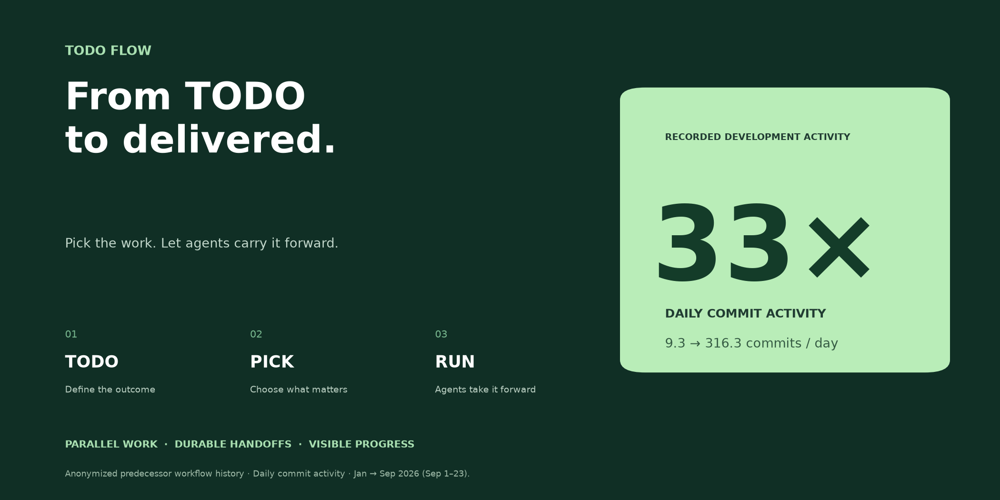
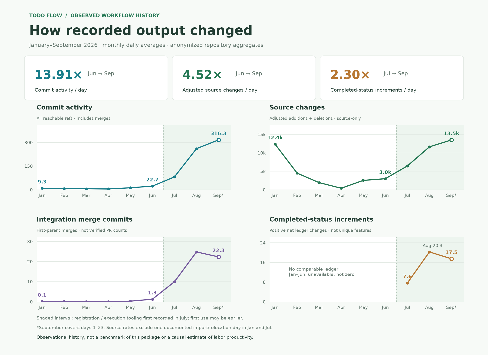
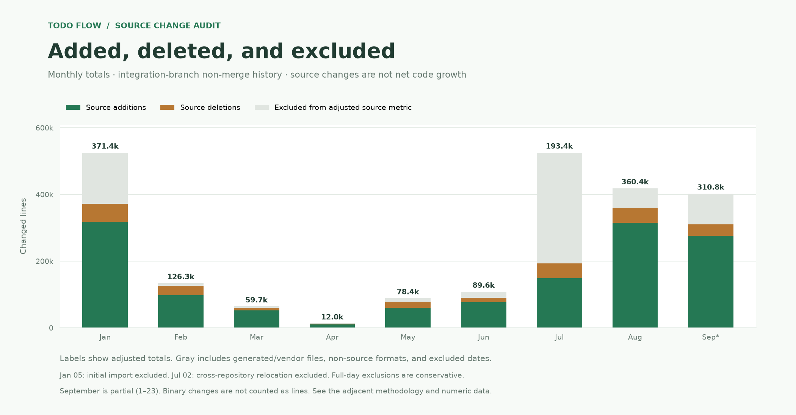
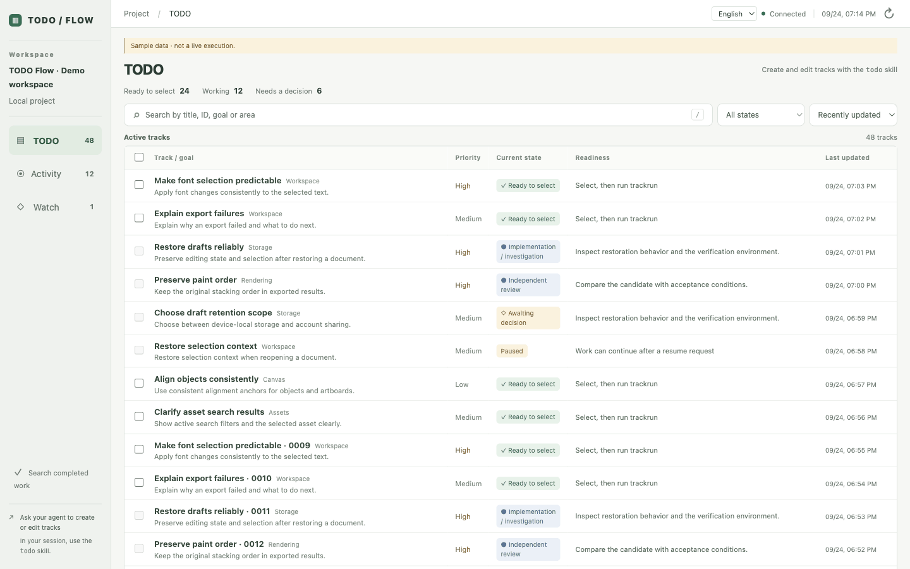

# TODO Flow

**할 일을 고르면, 에이전트가 이어서 진행합니다.**

선택한 TODO를 병렬 작업·독립 리뷰·검증된 반영으로 연결합니다. 세션이 끝나도 파일에 상태가 남고, 대시보드에서 누가 무엇을 하는지 확인할 수 있습니다.

[English](README.md) · **한국어**

[시작하기](#시작하기) · [작동 화면](#작동-화면) · [에이전트 설치 안내](AGENT_INSTALL.md) · [운영 안내](OPERATIONS.md)

[](LICENSE) [](#현재-범위)

## 개발 활동, 최대 33배.



**등록하고, 고르고, 실행하세요.** 사람은 방향을 정하고, 에이전트는 조사·구현·검증·리뷰와 허용된 랜딩·트리아지를 이어갑니다.

<sub>익명 선행 운영 사례에서 2026년 1월 대비 9월 일평균 커밋은 9.3 → 316.3건입니다. 9월은 1~23일 관측이며, 커밋 활동 기준입니다. 노동 생산성 배수나 현재 패키지의 벤치마크를 뜻하지 않습니다.</sub>

<details>
<summary>1~9월 성장 기록과 측정 근거</summary>



6월 대비 9월 보정 소스 변화량/일은 **4.52배**, 7월 대비 완료 전환/일은 **2.30배**입니다. 1월 대비 소스 변화량은 1.09배이며, 9월 완료 전환은 8월보다 낮았습니다.



[측정 방법과 월별 수치](assets/metrics/README.md) · [JSON](assets/metrics/measurements.json) · [CSV](assets/metrics/monthly.csv). 조건을 통제한 인과 실험이 아닌 선행 운영 기록입니다.

</details>

## 작동 화면



*실제 대시보드에 명시적으로 표시된 합성 데이터를 넣어 촬영한 UI 데모입니다. 실제 모델 실행 영상은 아닙니다.*

[한국어 화면](assets/demo/dashboard-ko.png) · [영어 화면](assets/demo/dashboard-en.png) · [데모 재현](DEMO.md) · [트랙 문서 예제](examples/retry-backoff.html)

## 이런 작업에 활용하세요

| 필요 | 제공하는 구조 |
|---|---|
| 여러 요구를 함께 진행 | 선정한 트랙을 별도 Git 워크트리에서 진행 |
| 세션 종료 후 이어받기 | 목표·작업권·결과·질문·다음 작업을 파일로 보존 |
| 구현 전에 계획 판단 | 이미지·SVG·스크립트·시뮬레이션을 포함한 HTML 트랙 문서. Markdown도 HTML로 렌더 |
| 현재 담당과 대기 이유 확인 | 밀도 높은 연속 목록과 실행 현황. 완료 내역은 별도 검색 |
| 근거를 확인하며 반영 | 정확한 후보 검증, 독립 에이전트 리뷰, 허용된 랜딩과 후속 트리아지 |

## 시작하기

설치 시 기본 언어를 **English(`en`) / 한국어(`ko`)** 중 선택합니다. 대시보드 기본 표시와 새 문서·에이전트 보고에 사용합니다. 스킬 지침 자체는 영어이며, 대시보드의 언어 전환은 개인 표시 설정으로 따로 저장됩니다.

에이전트에게 다음처럼 요청할 수 있습니다.

```text
이 체크아웃의 AGENT_INSTALL.md에 따라 /absolute/my-project에 TODO Flow를
설치해줘. 기본 언어는 한국어로 해줘.
첫 작업은 [원하는 변경과 기대 결과]야. HTML TODO를 등록하고 문서 링크를
보여줘. 이 요구에 맞는 트랙을 선정해 첫 런까지 진행하고 실제 결과를 알려줘.
```

언어를 지정하지 않았다면 설치 에이전트가 선택을 묻습니다. 설치만 요청하면 설치까지만 진행합니다.

직접 설치할 때는 Python 3.11+, uv, Git과 인증된 Claude/Codex CLI가 필요합니다. GitHub 이슈·PR 연동에는 인증된 `gh`도 필요합니다. TODO Flow 체크아웃에서:

```sh
uv sync --frozen
uv tool install .
```

초기 커밋과 `origin`이 있는 대상 프로젝트로 이동합니다. 아래는 Python 프로젝트 예시이므로 검증 명령·기준 브랜치·파일 범위를 실제 프로젝트에 맞게 지정하세요.

```sh
cd /absolute/my-project
todo-flow init --repo . --base main --worker codex --language ko \
  --verify '["python3","-m","unittest","discover","-v"]' \
  --write 'src/*.py' --write 'tests/*.py' \
  --context 'src/*.py' --context 'tests/*.py' --context README.md

todo-flow install-skills --target .agents/skills
todo-flow serve --port 8765
```

Claude 세션에는 `.claude/skills`를 사용합니다. 스킬은 프로젝트 언어를 상속합니다. `--language`를 생략하면 터미널에서는 선택을 묻고 비대화형 실행에서는 영어를 사용합니다. GitHub 연동에는 초기화 시 `--github OWNER/REPOSITORY`를 추가합니다.

**http://127.0.0.1:8765**에서 대시보드를 확인하세요. 문서가 등록·렌더되고 첫 실행이 설정된 종료점에 도달했는지까지 확인합니다.

## 첫 TODO에서 결과까지

에이전트 세션에서 요구를 등록하고 후보를 선정합니다.

```text
todo 일시적인 네트워크 오류에 제한된 재시도를 추가하고 테스트해줘.
todo 재시도할 수 없는 요청에 이해할 수 있는 오류 안내를 추가해줘.
trackpicks
```

문서를 검토하고 대시보드에서 선택한 명령을 복사하거나 추천받은 실제 ID로 실행합니다.

```sh
trackrun retry-backoff request-error-message
```

위 ID는 예시입니다. `todo`, `trackpicks`는 에이전트 스킬 요청이고 `trackrun`은 설치되는 터미널 명령이기도 합니다.

**기본 종료점은 `review`**입니다. 리뷰된 후보를 보존하며 자동 랜딩하지 않습니다. 초기화에 `--endpoint land --allow-land`를 추가하면 허용된 랜딩 뒤 트리아지·완료 확인과 연결된 이슈 종료까지 진행합니다. 원래 범위의 결함은 재작업하고, 별도 후속 TODO는 등록 후 사용자의 선정을 기다립니다.

## 구조와 지원 범위

공용 엔진은 한 번 설치하고, 프로젝트마다 설정·파일·스킬·워크트리를 둡니다. 실행 프로세스와 대시보드는 프로젝트별로 동작합니다. 워커가 현재 필요한 작업을 제안하며, 호스트는 작업권·근거·외부 반영을 확인합니다. 상주 감독 에이전트나 고정된 전역 단계 순서는 없습니다.

- Claude/Codex CLI 워커, Git 원격과 선택적 GitHub 연동.
- 파일 정본과 재생성 가능한 SQLite 조회 캐시. 에이전트는 `rg`로 검색할 수 있습니다.
- 영어·한국어 프로젝트 설정 및 대시보드 UI.
- macOS 로컬 검증. Linux CI 검사 구성. 현재 POSIX 프로세스·잠금 구현은 Windows를 지원하지 않습니다.

## 업데이트

```sh
todo-flow --version
todo-flow --state /absolute/project/todo compatibility --target /absolute/project/.agents/skills
```

uv tool로 설치했다면 `todo-flow upgrade --wheel /absolute/new-release.whl --dry-run`으로 엔진 업데이트를 확인합니다. 모든 실행기·대시보드를 종료한 뒤 `--dry-run`을 빼고 적용합니다. 알려진 프로젝트의 형식을 검사하고 설치본을 백업하며, 설치·검증 실패 시 이전 엔진을 복구합니다. 신뢰할 수 있는 새 버전 wheel을 직접 지정하는 방식이며 최신 버전 자동 검색은 아직 없습니다.

프로젝트마다 `todo-flow --state STATE update-skills --target PATH --dry-run`으로 스킬 변경을 확인하고 적용합니다. 사용자 수정과 언어·상태 경로를 보존하며, 양쪽에서 바뀐 파일은 덮어쓰기 전에 충돌을 알립니다. 엔진과 스킬은 각각 백업 ID로 롤백할 수 있습니다.

[업데이트·복구 안내와 후속 준비 목록](UPDATES.md)을 참고하세요. 현재 데이터 형식은 유지하며 미래 형식의 자동 마이그레이션은 아직 제공하지 않습니다.

## 자주 묻는 질문

**에이전트를 대체하나요?** 인증된 Claude/Codex CLI를 이용해 선정한 작업을 진행하는 실행 도구입니다.

**세션이 끊기면요?** 같은 파일 상태로 `todo-flow --state STATE run`을 실행해 이어갑니다. 종료를 성공으로 취급하지 않습니다.

**DB 서버가 필요한가요?** 없습니다. 프로젝트의 `todo/` 또는 지정한 STATE가 정본이고 SQLite는 삭제 가능한 조회 캐시입니다.

**복수 트랙은 얼마나 실행하나요?** 여러 ID를 전달할 수 있습니다. `--jobs`는 한 드라이버의 동시 작업 상한이며 기본 2입니다. 선정한 트랙 수를 뜻하지 않습니다.

**비용은요?** 프로그램은 MIT이며 모델·외부 서비스 비용은 연결한 계정의 요금에 따릅니다. 병렬 작업은 모델 사용량을 늘릴 수 있습니다.

**대시보드에서 언어를 바꾸면 문서도 바뀌나요?** UI 표시만 바뀝니다. 작성된 문서·로그와 워커의 프로젝트 언어 설정은 유지합니다.

**Jev가 필수인가요?** 아닙니다. todo·watchlist에서 조사·중복·변경 영향 선별을 돕는 선택 도구로 권장합니다. 없어도 먼저 작업을 진행하며 자동 설치나 필수 호출을 요구하지 않습니다.

## 현재 범위

개발 버전 **0.0.1**입니다. 소규모 전체 사이클·복구·독립 트랙 2~3개 동시 실행을 확인했으며, 대량 목록은 별도 합성 데이터로 검증했습니다.

- 상태 하나당 저장소 하나. Forgejo·서브모듈·복수 저장소 결합 랜딩 미지원.
- 기본 워커는 도구 없는 파일 스냅샷을 받아 JSON 변경안을 반환합니다. 직접 셸·브라우저·저장소 탐색 미지원.
- 입력 텍스트 150,000바이트 제한. 파일 삭제·바이너리 수정 미지원.
- 기본 워커 제한 시간 600초, 실행기당 작업 배정 상한 100. 남은 요청은 다음 실행에서 이어갑니다.
- 드라이버 간 합산 슬롯 제어, 별도 무거운 검증 큐, 분산 파일시스템 운영 미검증.

[영문 운영·복구 안내](OPERATIONS.md) · [에이전트 설치](AGENT_INSTALL.md) · [데모](DEMO.md) · [기여](CONTRIBUTING.md) · [변경 기록](CHANGELOG.md) · [MIT 라이선스](LICENSE)

버그·개선 제안은 저장소 Issues에 공개 가능한 최소 재현과 함께 남겨주세요. `docs/`는 로컬 기록용이며 사용·빌드에 필요하지 않습니다.
