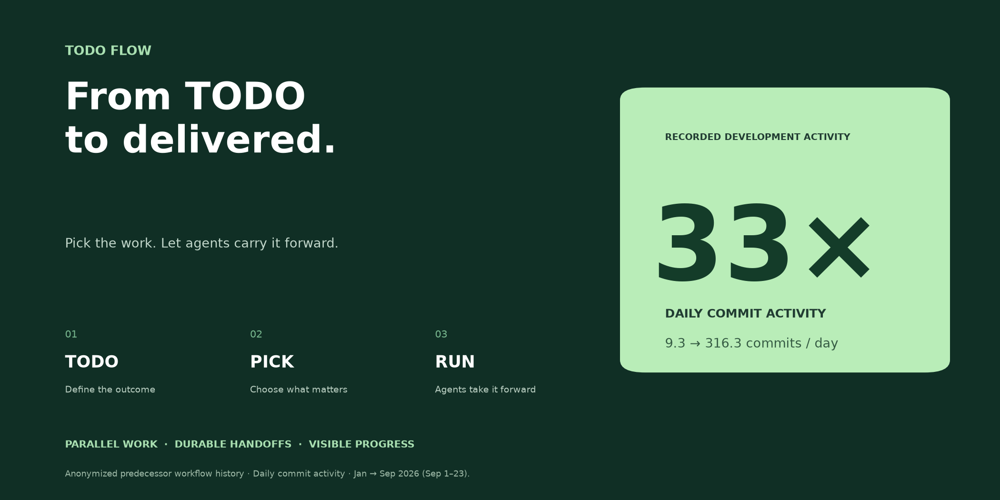
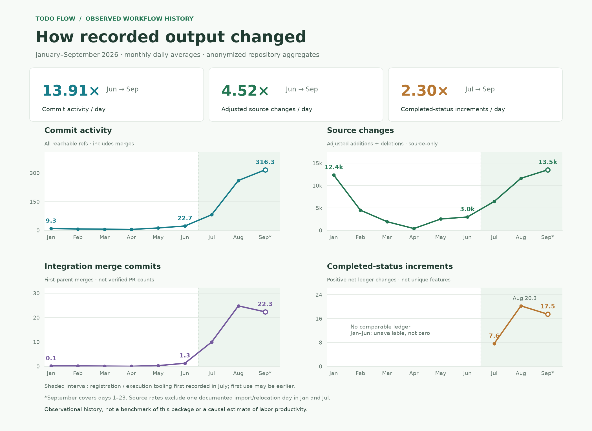
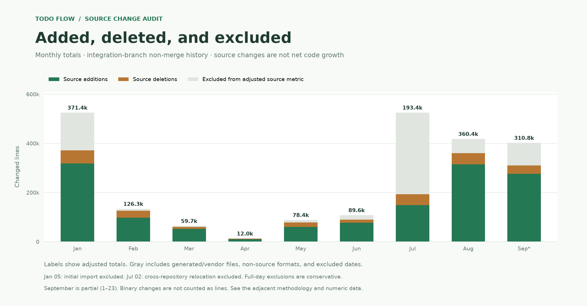
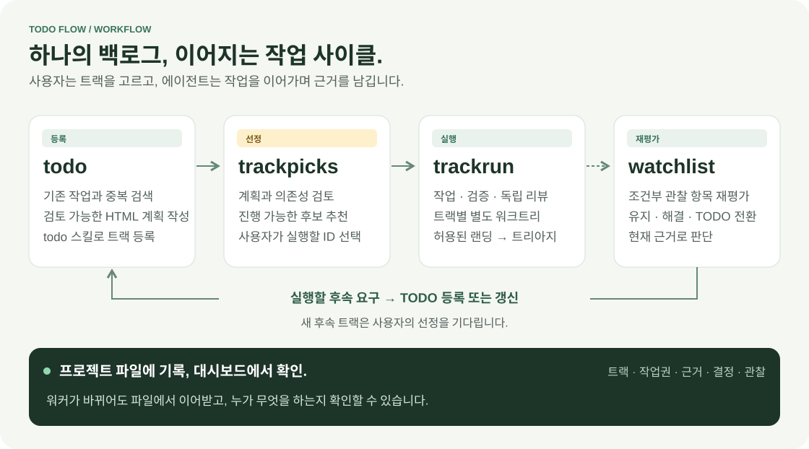
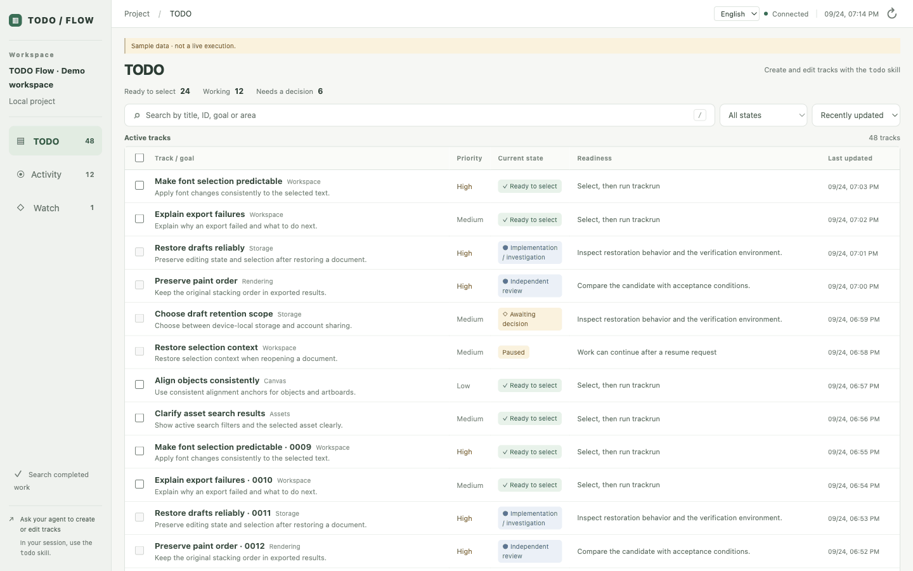

# TODO Flow

**할 일을 고르면, 에이전트가 이어서 진행합니다.**

선택한 TODO를 병렬 작업·독립 리뷰·검증된 반영으로 연결합니다. 세션이 끝나도 파일에 상태가 남고, 대시보드에서 누가 무엇을 하는지 확인할 수 있습니다.

[English](README.md) · [한국어](README.ko.md) · [日本語](README.ja.md) · [简体中文](README.zh-CN.md)

[설치](AGENT_INSTALL.ko.md) · [운영](OPERATIONS.ko.md) · [업데이트](UPDATES.ko.md) · [데모](DEMO.ko.md)

[시작하기](#quick-start) · [작동 화면](#see-it-in-action) · [에이전트 안내](#for-agents) · [운영 안내](OPERATIONS.ko.md)

[](LICENSE) [](#current-scope) [](pyproject.toml)

<!-- translation-source: README.md; source-sha256: 02e2117958fbe35650f9b24fbd5893d58caafaa9f57eebe4f196d4f9cb32bcdc; status: translated -->

## 37초로 보는 TODO Flow

https://github.com/user-attachments/assets/bb7d4605-90cd-4e4c-8374-7d22495a0e8a

*트랙 선정부터 병렬 작업, 세션 인계, 검증·리뷰와 반영까지 보여주는 지하철 노선도 형식의 모션 인포그래픽입니다.*

## 개발 활동, 최대 33배.



**등록하고, 고르고, 실행하세요.** 사람은 방향을 정하고, 교체 가능한 에이전트는 조사·구현·검증·리뷰와 허용된 랜딩·트리아지를 이어갑니다.

<sub>익명 선행 운영 사례에서 2026년 1월 대비 9월 일평균 커밋은 9.3 → 316.3건입니다. 9월은 1~23일 관측이며, 커밋 활동 기준입니다. 노동 생산성 배수나 현재 패키지의 벤치마크를 뜻하지 않습니다.</sub>

<details>
<summary>1~9월 성장 기록과 측정 근거</summary>



6월 대비 9월 보정 소스 변화량/일은 **4.52배**, 7월 대비 완료 전환/일은 **2.30배**입니다. 지표마다 나타내는 결과가 다릅니다. 1월 대비 소스 변화량은 1.09배이며, 9월 완료 전환은 8월보다 낮았습니다.



[측정 방법과 월별 수치](assets/metrics/README.md) · [JSON](assets/metrics/measurements.json) · [CSV](assets/metrics/monthly.csv). 조건을 통제한 인과 실험이 아닌 선행 운영 기록입니다. 식별 가능한 원자료는 공개하지 않습니다.

</details>

## 워크플로우 사이클



**`todo` → `trackpicks` → `trackrun` → `watchlist` → `todo`.** 검토 가능한 계획을 등록하고, 할 일을 고르고, 선택한 트랙을 실행한 뒤 후속 관찰을 재평가합니다. 대시보드에서 직접 트랙을 골라도 됩니다. 체크박스는 새 실행 요청을 받을 수 있는 트랙에서만 활성화됩니다. **요청됨**, **일시정지**, **일시정지 요청** 상태인 트랙은 다시 선택할 수 없습니다. 트랙 제목을 눌러 상세를 확인하고, 일시정지된 작업은 그 화면에서 **재개**를 요청할 수 있습니다. `trackpicks`는 후보를 추천하며 워커를 실행하지 않습니다.

`trackrun`은 기본적으로 리뷰에서 멈춥니다. 랜딩이 허용되면 랜딩과 트리아지까지 진행하며 해당 트랙의 열린 관찰도 재평가합니다. `watchlist`로 명시적인 재평가를 요청할 수 있고, 실행할 후속 요구는 기존 또는 새 TODO로 연결합니다. 새 후속 트랙은 사용자의 선정을 기다립니다. 이 사이클은 공유 상태에 접근하는 진입점이며 모든 트랙에 강제되는 단계 순서는 아닙니다.

<a id="see-it-in-action"></a>

## 작동 화면

**이 저장소 자체에도 TODO Flow를 적용하기 시작했습니다.** [실제 설정·대시보드 화면·재현 방법](examples/self-hosting/README.md)을 공개합니다. 최초 기록은 아직 트랙이 등록되지 않은 설치 완료 상태이며, 실제 작업을 실행하면서 결과를 덧붙입니다.



*실제 대시보드에 명시적으로 표시된 합성 데이터를 넣어 촬영한 UI 데모입니다. 실제 모델 실행 영상은 아닙니다.*

[한국어 화면](assets/demo/dashboard-ko.png) · [영어 화면](assets/demo/dashboard-en.png) · [데모 재현](DEMO.ko.md) · [계획 미리보기](assets/demo/track-example.png) · [트랙 HTML 예제](examples/retry-backoff.html) · [실제 이슈 → 병합된 PR](DEMO.ko.md#이전-공개-인수-테스트-살펴보기)

데모에서는 밀도 높은 연속 TODO 목록, `trackrun` 실행을 위한 선정, 현재 워커와 결정 대기, 풍부한 트랙 문서, 별도의 완료 아카이브를 보여 줍니다. 전체 실행 경로는 [두 트랙 실행 안내](DEMO.ko.md#전체-워크플로-실행)를 따르거나 일회용 프로젝트에서 문서에 설명된 실제 인수 테스트를 실행하세요.

## 이런 작업에 활용하세요

| 필요 | 제공하는 구조 |
|---|---|
| 여러 요구를 함께 진행 | 선정한 트랙을 별도 Git 워크트리에서 진행하며 워커는 제한된 작업 단위를 담당 |
| 세션 종료 후 이어받기 | 문서·작업권·결과·질문·후속 작업 의도를 검색 가능한 파일로 보존 |
| 구현 전에 계획 판단 | 이미지·다이어그램·스크립트·시뮬레이션을 포함한 HTML 트랙 문서. Markdown도 HTML로 렌더 |
| 현재 담당과 대기 이유 확인 | 현재 작업·담당·대기·근거를 보여 주는 간결한 대시보드. 완료 내역은 별도 아카이브 |
| 근거를 확인하며 반영 | 정확한 후보 검증, 독립 에이전트 리뷰, 허용된 랜딩과 후속 트리아지 |

독립적인 변경이 쌓인 백로그, 여러 세션에 걸친 작업, 통합 전 여러 후보 변경을 검토하는 데 유용합니다. 개발 브랜치의 워커는 작업 공간과 근거 경로를 전달받고 필요한 파일을 직접 검색하고 읽습니다. 릴리스별 제공 여부와 남은 제약은 [현재 범위](#current-scope)를 참고하세요.

<a id="quick-start"></a>

## 시작하기

프로젝트 설정 시 **English(`en`), 한국어(`ko`), 日本語(`ja`), 简体中文(`zh-CN`)** 중 선택합니다. 프로젝트의 대시보드 기본 표시와 에이전트에게 요청하는 새 트랙 문서·보고 언어를 정합니다. 스킬 지침 자체는 영어입니다. 대시보드의 English / 한국어 / 日本語 / 简体中文 전환은 개인 표시 설정으로 따로 저장됩니다.

### 에이전트에게 설치 맡기기

프로젝트 경로와 첫 작업을 채워 에이전트 세션에 붙여 넣으세요.

```text
https://github.com/JakeB-5/todo-flow/blob/main/AGENT_INSTALL.ko.md에 따라
/absolute/my-project에 TODO Flow를 설치해줘.
언어를 지정하지 않았다면 en, ko, ja, zh-CN 중 선택하도록 물어봐.
첫 작업은 [원하는 변경과 기대 결과]야. 검토 가능한 HTML TODO를 등록하고
문서 링크를 보여줘. 이 요구에 맞는 트랙을 선정해 실행하고 실제 결과와
다음 단계를 알려줘.
```

[에이전트 안내](#for-agents)에 설치 계약을 설명합니다. 설치만 요청하면 설치까지만 진행합니다. 위 예시는 첫 실행도 요청합니다.

### 직접 설치하기

**Python 3.11+, uv, Git과 인증된 Claude 또는 Codex CLI**가 필요합니다. GitHub 이슈·PR 연동에는 인증된 `gh`도 필요합니다. 공개 릴리스로 설치합니다.

```sh
uv tool install https://github.com/JakeB-5/todo-flow/releases/download/v0.0.9/todo_flow-0.0.9-py3-none-any.whl
todo-flow --version
```

[배포 파일과 체크섬](https://github.com/JakeB-5/todo-flow/releases/tag/v0.0.9). 체크아웃 없이 CLI·대시보드·스킬 묶음을 설치합니다. 소스 개발 시에는 저장소를 복제하고 `uv sync --frozen`, `uv tool install .`을 사용하세요.

**대상 프로젝트**의 실제 검증 명령·기준 브랜치·관련 파일 범위를 사용하세요. 아래는 테스트 모음, 초기 Git 커밋과 `origin` 원격이 있는 기존 Python 프로젝트 예시입니다.

```sh
cd /absolute/my-project
todo-flow init --repo . --base main --worker codex \
  --language ko \
  --verify '["python3","-m","unittest","discover","-v"]' \
  --write 'src/*.py' --write 'tests/*.py' \
  --context 'src/*.py' --context 'tests/*.py' --context README.md

todo-flow install-skills --target .agents/skills
todo-flow serve --port 8765
```

다른 언어에는 `--language en`, `--language ja`, `--language zh-CN`을 사용합니다. 생략하면 대화형 터미널에서는 선택을 묻고 터미널이 없으면 영어를 사용합니다. Claude 세션에는 `.claude/skills`를 사용합니다. 스킬은 프로젝트 언어를 상속합니다. GitHub 이슈·PR 연동에는 `init`에 `--github OWNER/REPOSITORY`를 추가합니다.

**http://127.0.0.1:8765**를 여세요. 에이전트에게 설치한 todo 스킬 사용을 요청하고, 생성된 문서를 검토한 뒤 실제 ID를 선정해 실행합니다. 대시보드가 열리고 등록한 문서가 렌더되며 요청한 첫 실행이 설정된 종료점에 도달하면 설정 완료입니다. [상세 설치·복구 안내](AGENT_INSTALL.ko.md)를 참고하세요.

### 다른 워크플로우와 공존 설치

충돌이 없으면 9개 스킬의 기존 이름과 호출을 그대로 유지합니다. Codex는 `.agents/skills`, Claude는 `.claude/skills`에 설치합니다. `todo-flow install-skills --help`에서 `--alias` 지원을 확인하세요. 이전 릴리스에는 이 기능이 포함된 승인된 업데이트나 소스 빌드가 필요할 수 있습니다.

다른 워크플로우가 실제로 점유한 이름에만 별칭을 지정합니다. 아래 예시는 `todo`, `track-picks`, `track-run`, `watchlist`가 점유되어 있고 네 별칭은 비어 있다고 가정합니다.

```sh
FLOW_STATE=/absolute/my-project/todo-flow-state
FLOW_SKILLS=/absolute/my-project/.claude/skills
todo-flow --state "$FLOW_STATE" install-skills --target "$FLOW_SKILLS" \
  --alias todo=flow-todo --alias track-picks=flow-track-picks \
  --alias track-run=flow-track-run --alias watchlist=flow-watchlist
```

이미 초기화한 TODO Flow 프로젝트는 기존 STATE를 유지하세요. 다른 도구가 `todo/`를 소유하면 초기화 전에 별도 STATE를 정하고 앞의 `init` 명령에도 `--state "$FLOW_STATE"`를 지정합니다. 다른 도구의 상태 위에 초기화하거나 `--adopt`로 그 스킬을 가져오지 마세요. 별칭도 점유되어 있으면 전체 스킬 설치를 중단하므로 비어 있는 별칭이나 에이전트가 지원하는 별도 설치 경로를 선택합니다. 기존 파일·링크를 보존하며 충돌하지 않은 역할의 이름은 바꾸지 않습니다.

설치 보고의 `entrypoints`(정식 역할 → 설치된 이름), `state`, `language`와 각 스킬의 `project.json`을 확인하세요. 예시에서는 에이전트에게 `flow-todo`, `flow-track-picks`, `flow-track-run`, `flow-watchlist` 사용을 요청합니다. 원래 점유된 이름은 기존 워크플로우를 계속 가리킵니다. `trackrun`과 내부 역할 이름은 유지되며 설치된 역할 연결표가 실제 TODO Flow 진입점을 안내합니다. 셸 명령은 계속 `todo-flow`, `trackrun`입니다. 별도 STATE 실행에는 `trackrun --state "$FLOW_STATE" ACTUAL_TRACK_ID`를 사용하세요.

업데이트는 별칭을 다시 지정하지 않고 저장된 매핑을 사용합니다.

```sh
todo-flow --state "$FLOW_STATE" update-skills --target "$FLOW_SKILLS" --dry-run
# 계획을 확인하고 충돌을 해결한 뒤 적용합니다.
todo-flow --state "$FLOW_STATE" update-skills --target "$FLOW_SKILLS"
```

배포본 파일이 바뀌지 않았으면 로컬 수정을 보존하며 양쪽에서 변경했으면 전체 업데이트를 중단합니다. 설치 manifest를 유지하세요. `--recover`, `--rollback BACKUP_ID` 사용은 [공존 설치·복구·롤백 안내](AGENT_INSTALL.ko.md#coexist-with-occupied-skill-names)를 참고하세요. 일회용 번들 테스트는 파일 배치·메타데이터·링크를 검사합니다. 실제 Claude 세션의 발견·모델 호출은 별도 검증이며 이 테스트에서는 수행하지 않습니다. 현재 세션이 설치 결과를 반영하지 않았다면 새 세션을 열거나 설치된 `SKILL.md`를 명시적으로 읽으세요.

### 요청별 워커 라우팅

트랙의 `workerPlan`에 필요한 역할별 `provider`, `model`, 추론 `effort`, 선정 근거 `basis`를 기록합니다. 실행에는 `trackrun TRACK_ID --worker-mode auto`, `--worker-mode codex-only`, `--worker-mode claude-only`를 사용합니다. `--worker-roles FILE.json`으로 역할별 명시 선택을 전달할 수 있습니다. [선정 가이드와 전체 예제](skills/todo/worker-routing.md)를 참고하세요. 전용 모드에는 허용된 공급자의 역할 선택 또는 프로젝트 기본값/프로필이 필요하며, 기존 권장값이 충돌해도 금지된 공급자를 실행하지 않습니다.

요청별 스냅샷은 `--request-only`, 드라이버 재시작, 일시정지/재개, repair/재시도에도 유지됩니다. 옵션을 생략한 반복 요청은 선택을 보존하고, 명시적 재선정은 이후 새 attempt에만 적용됩니다. 프로젝트 기본값·기존 영수증·불확실한 launch는 변경하지 않습니다. 계획과 새 라우팅 옵션이 없는 기존 트랙은 단일/custom adapter를 유지합니다. `worker-selection.json`의 선택값과 native 영수증의 공급자 확인값을 구분하며, 응답이 없으면 확인값은 null일 수 있습니다. 등록은 역할을 권장할 뿐 실행하지 않습니다. 최상위 트랙 `effort`는 계속 공수 추정입니다.

### 요청별 워커 시도 한도

명시적으로 실행을 제한하려면 `trackrun TRACK_ID --worker-attempt-limit 10` 또는 `todo-flow --state STATE start TRACK_ID --worker-attempt-limit 10`을 사용합니다. 양의 정수 한도는 선정한 각 트랙의 요청에 따로 적용됩니다. 생략하면 기존 요청 무제한 정책을 유지합니다. `--max-tasks`는 여전히 기본값 100이며 한 드라이버 실행이 처리하는 작업 수만 제한합니다. 드라이버 재시작은 요청의 워커 한도를 초기화하지 않습니다.

평가·구현·독립 리뷰·triage·watch 시도는 claim 시점에 원자적으로 한 번 차감합니다. 워커 시작 전 실패를 포함한 실패·중단 시도도 사용량에 남습니다. 호스트 검증·landing·완료 작업은 워커 시도를 차감하지 않습니다. `budgets/` 파일이 한도와 누적 사용량을 보존하며 `status`, 드라이버 출력, 결정과 예산 이벤트에서 사용량·후보 HEAD·남은 작업을 확인할 수 있습니다. 한도 정지는 결과와 미완료 의무를 보존하며 목표 완료 판정이 아닙니다.

한도 정지는 `todo-flow --state STATE answer DECISION_ID --text '추가 시도 승인' --additional-worker-attempts 5`로 재개하고, 필요하면 `todo-flow --state STATE run`을 다시 실행합니다. 양의 정수 증분을 기존 총한도에 더하며 사용량과 대기 작업을 유지합니다. 일반 답변, `pause`/`resume`, `start`/`trackrun` 반복은 추가 시도를 승인하지 않습니다. 예산 승인은 CLI를 사용하고 다른 결정에는 기존 대시보드 답변을 사용할 수 있습니다.

### 선택적 검증 사전 검사 실행

새 상태의 `init` 명령에 다음 인자를 추가하면 명시적으로 선택한 저비용 검사를 기존 `--verify` 명령보다 먼저 실행합니다.

```sh
--verify-preflight '[["uv","run","ruff","check","src","tests"],["uv","run","ruff","format","--check","src","tests"]]'
```

위 코드는 독립 명령이 아닌 인자입니다. 예시 도구를 먼저 설치하거나 프로젝트에서 실행 가능한 argv 배열로 바꾸세요. 검사들은 후보 작업 공간에서 지정한 순서대로 실행되며 암묵적인 셸을 사용하지 않습니다. 기존 검증 환경과 `--verify-timeout`을 각 명령에 적용합니다. 첫 실패나 시간 초과에서 멈추고, 취소 시 감독 중인 프로세스를 종료하며 이후 명령은 실행하지 않습니다. 모든 사전 검사가 성공해야 기존 전체 검증 명령을 실행합니다. 사전 검사 성공만으로 검증 성공이나 랜딩 자격을 부여하지 않습니다.

옵션을 생략하거나 `[]`를 지정하면 기존 실행 동작을 유지합니다. 검증 기록에는 실행한 검사별 단계·argv·로그 참조가 남고, 명시적 요구 위반은 수정 작업으로, 실행 결과의 판정 불가는 진단 작업으로 이어집니다. 검사 목록과 순서도 검증 입력 동일성에 포함되므로 변경하면 이전 성공을 재사용하지 않습니다. 외부 검사 스크립트 등 관련 입력은 아래의 `--verify-identity`로 선언하세요. 기존 상태는 `init`으로 재설정할 수 없으며 아래에 설명한 설정 마이그레이션 제한이 동일하게 적용됩니다.

### 중간 검증 검사 선택

새 상태에서는 `init`에 `--verify-related '[["uv","run","python","-m","unittest","tests.test_calc"]]'`를 추가해 중간 변경에 사용할 관련 검사를 명시할 수 있습니다. 예시는 프로젝트에서 지원하는 검사로 교체하세요. 순서가 있는 argv 배열을 `verify_related`로 저장하며 자동 영향 분석은 수행하지 않습니다. 사전 검사와 마찬가지로 기존 상태는 `init`으로 재설정할 수 없습니다.

중간 변경 제안은 사전 검사 후 관련 검사를 실행합니다. 각 명령에는 동일한 후보 작업 공간·캡처한 환경·검증 제한 시간과 취소·실패 처리가 적용됩니다. partial 성공은 피드백만 제공합니다. 워커의 `verify:true`, 게시 요청 또는 review/land/complete 후속 요청에는 기존 전체 `verify` 명령을 실행합니다. 명시적 검증 작업·복구된 제안·통합 검증도 전체 검증을 요구합니다. 사전 검사는 선택된 두 경로 모두에 먼저 적용되며 관련 검사는 전체 검증 명령의 일부를 대체하지 않습니다.

`verify_related`를 생략하거나 `[]`로 설정하면 변경마다 전체 검증하는 기존 동작을 유지합니다. 범위와 관련 검사 정책·순서를 검증 신원에 결속하므로 partial 결과를 전체 검증 캐시나 외부 효과 승인 근거로 재사용하지 않습니다. 정책 변경 시 기존 근거는 무효화됩니다. 관련 정책이 없는 경우 지원되는 신원이 일치하는 기존 full 기록은 계속 유효하며, 신원이 없는 기록은 다시 검증합니다. 외부 관련 검사 스크립트도 `--verify-identity`로 선언하세요. 로컬 회귀 fixture는 중간 변경 두 번과 최종 후보 한 번에서 전체 호출이 3회에서 1회로 줄고 최종 결함도 검출되는지 비교합니다. 실제 실행 시간의 개선을 보장하지 않습니다.

### 검증 결과

검증 기록은 기존 `ok`와 함께 `outcome`(`passed`, `failed`, `inconclusive`) 및 `reason`을 저장합니다. `passed`와 `ok:true`가 함께 있어야 성공 근거가 되며, 기존 범위·깨끗한 HEAD·입력 동일성·프로세스·독립 리뷰 장벽도 충족해야 합니다. 명시적 비통과·취소·불완전 근거 또는 통과하지 않은 개별 검사 기록을 `ok:true`로 덮어 승인하지 않습니다.

검사기는 **stdout의 마지막 줄**에 JSON 객체와 고정 접미사 ` TODO_FLOW_RESULT_V1`을 출력해 결과를 명시할 수 있습니다.

```text
{"outcome":"failed","reason":"add(2, 3) returned 6; expected 5"} TODO_FLOW_RESULT_V1
```

해당 줄은 UTF-8 기준 4096바이트 이하여야 하며 `reason`은 비어 있지 않은 문자열이어야 합니다. 앞에는 일반 로그를 출력할 수 있습니다. 표시된 결과의 형식이 잘못되면 판정 불가입니다. 검사기는 실제 요구 위반(`failed`)과 환경·검사 실행 실패(`inconclusive`)를 구분할 책임이 있습니다. 호스트는 `AssertionError`, 설치 진단이나 다른 예외 문자열만으로 이를 추측하지 않습니다. 명시적 실패는 비정상 exit와 함께 보고할 수 있지만 로그 영수증이 완전해지는 것은 아닙니다. 명시적 통과에는 여전히 정상 exit·완전한 출력·확인된 정상 프로세스 종료가 필요합니다. 시간 초과와 잔여 프로세스는 결과 선언보다 우선합니다.

호환 규칙: 결과 표시 없는 정상 명령은 기존 장벽 아래에서 성공으로 유지합니다. 표시 없는 비정상 명령도 기존처럼 `ok:false`이며, exit code만으로 요구 위반을 입증할 수 없어 새 분류는 `inconclusive`입니다. 과거 boolean 기록은 다시 쓰지 않습니다. `ok:true`는 지원되는 입력 동일성과 기존 장벽이 맞는 경우에만 재사용하고, `ok:false`는 명시적 요구 위반 결과가 없는 한 비통과를 유지하며 판정 불가로 표시·연결합니다. 구조화된 결과가 없거나 알 수 없는 값이면 성공을 승인하지 않습니다.

verify 작업과 제안 후 검증 모두 `failed`는 요구 수정 작업으로, `inconclusive`는 기록된 단계·로그·환경을 조사하는 assess 작업으로 연결합니다. 진단은 후보를 보존하며 승인된 복구 후 같은 HEAD의 재검증을 요청하거나, 복구가 불명확하면 구체적인 결정을 질문합니다. 자동 의존성 설치나 추측에 따른 제품 수정은 승인하지 않습니다. 통합 검증의 판정 불가는 제품 수정에 착수하는 대신 후보 근거를 보존하고 복구 판단을 요청합니다. 비통과 결과는 성공 캐시로 쓰지 않으므로 제품 커밋 없이 환경 복구 후 재검증할 수 있습니다.

### 검증 입력 선언

`0.0.5`는 `init --verify-identity`를 지원합니다. **새 상태를 초기화할 때** 실제 `init` 명령에 아래와 같은 인자를 추가합니다. 예시 경로는 검증기가 실제 사용하는 기존 파일 경로로 바꾸세요.

```sh
--verify-identity '{"version":1,"files":["/absolute/verification/verify.py","/absolute/python/bin/python3","uv.lock"],"environment":["PATH","VERIFY_MODE"],"nonce":"baseline-1"}'
```

위 코드는 독립 명령이 아닌 인자입니다. `version`은 `1`이며, `files`에는 디렉터리나 glob 대신 개별 일반 파일을 넣습니다. 절대 경로는 외부 입력을 가리키고 `uv.lock` 같은 상대 경로는 검증 대상 후보 작업 공간을 기준으로 해석합니다. 외부 runner와 검증에 영향을 주는 입력·설정 파일을 명시적으로 선언하세요. 선언 파일이 없거나 읽을 수 없으면 이전 성공을 채택하지 않습니다. runner를 후보 쓰기 권한 밖에 두고 인터프리터·도구 버전을 고정하며 잠금 파일에 따른 의존성 설치를 유지하세요. 경로가 같거나 잠금 파일이 있다는 사실만으로 실제 설치 환경이 같다고 보장되지는 않습니다.

`environment`에는 `NAME=value`가 아닌 변수 이름을 넣습니다. 식별 근거에는 선택한 이름과 digest를 기록하고 값의 원문은 저장하지 않으며, 미설정과 빈 문자열을 구분합니다. 검증기는 캡처한 환경을 사용하고 호스트는 `GIT_TERMINAL_PROMPT=0`을 적용합니다. digest는 비밀번호 보호 수단이 아니며, 별도로 저장되는 runner 출력에 값이 노출될 수 있습니다. argv·출력·nonce에는 비밀을 넣지 마세요.

`nonce`가 달라지면 이전 식별 근거를 재사용하지 않습니다. 설정에는 원문, 식별 근거에는 digest가 저장되므로 비밀이 아닌 표식을 사용하세요. **현재 `Store.configure`는 기존 설정 변경을 거부하며 설정 갱신 CLI도 없습니다.** 새 상태 초기화 시 선언과 nonce를 정하세요. `init`을 다시 실행해 기존 nonce를 바꿀 수 없으며, 이를 우회하려고 정본 상태를 직접 수정하거나 삭제하면 안 됩니다. 기존 상태의 선언 변경에는 별도로 지원되는 설정 마이그레이션이 필요합니다. 이미 선언된 외부 입력의 내용을 의도적으로 변경하는 방법으로도 이전 식별을 무효화할 수 있습니다.

캐시 재사용에는 HEAD·tree·명령·제한 시간이 같고 작업 공간이 깨끗해야 한다는 조건도 적용됩니다. 식별 없는 기존 성공은 다시 검증하며 알 수 없는 식별 버전은 거부합니다. 실행 전후 파일 내용·해석된 경로·메타데이터를 관측해 일반적인 변경과 메타데이터가 달라지는 변경 후 원복을 탐지합니다. 불변 스냅샷 실행이나 권한 있는 주체의 메타데이터 조작 방어를 제공하는 것은 아닙니다. 미선언 파일·전이 의존성·환경 변수·원격 서비스는 추론하지 않습니다. 외부 runner의 구체적인 예시는 [자체 운영 선언과 한계](examples/self-hosting/README.md#declare-verification-inputs-with-a-supporting-engine)를 참고하세요.

## 첫 TODO에서 결과까지

에이전트 세션에서 다음과 같이 요청합니다.

```text
todo 일시적인 네트워크 오류에 제한된 재시도를 추가하고 테스트해줘.
todo 재시도할 수 없는 요청에 이해할 수 있는 오류 안내를 추가해줘.
trackpicks
```

에이전트가 기존 파일에서 중복 범위를 검색하고 HTML 계획을 등록합니다. 대시보드에서 문서를 검토하세요. 트랙을 선택해 명령을 복사하거나 `trackpicks` 추천을 사용합니다.

```sh
trackrun retry-backoff request-error-message
```

*위 ID는 예시이므로 직접 등록해 반환받은 ID를 사용하세요.* `todo`, `trackpicks`는 에이전트 스킬 요청이고 `trackrun`은 설치되는 터미널 명령이기도 합니다.

| 단계 | 확인할 수 있는 내용 |
|---|---|
| 등록과 검토 | HTML 계획, 범위, 근거, 완료 조건. [예제](examples/retry-backoff.html) |
| 선정과 실행 | 선정한 ID, 별도 워크트리, 현재 워커와 질문 |
| 검증과 리뷰 | 정확한 후보에 연결된 검증 출력과 독립 리뷰 |
| 랜딩과 트리아지 | 랜딩 종료점이 승인된 경우 통합 SHA, 발견 사항 처리, 이슈 종료와 완료 |

**기본 종료점은 `review`**이며 리뷰된 후보를 보존합니다. 초기화 시 자동 랜딩을 승인하려면 **`--endpoint land --allow-land`**를 추가하세요. 랜딩 뒤 트리아지에서 원래 범위의 수정, 별도 후속 작업과 조건부 관찰을 처리합니다. 새 후속 TODO는 사용자의 선정을 기다립니다.

<a id="for-agents"></a>

## 에이전트 안내

**[AGENT_INSTALL.ko.md](AGENT_INSTALL.ko.md)**를 읽고 요청된 설치와 첫 실행 범위를 수행하세요. 기존 설정과 승인을 재사용하세요. **기본 언어가 지정되지 않았다면 물어보고, `init --language en|ko|ja|zh-CN`으로 저장한 뒤 새 문서와 보고에 사용하세요.** 영어 README만 보고 언어를 추정하지 마세요.

완료 조건은 선정된 결과 또는 해당 변경의 영향을 받는 기존 불변 조건에 근거해야 합니다. 선택적 기능과 무관한 결함은 분리하고, 기록된 사용자 절충을 작업과 리뷰에 반영합니다. 개선점을 발견했다는 이유만으로 현재 트랙에 추가하지 않습니다.

[에이전트 설치 안내](AGENT_INSTALL.ko.md)는 프로젝트 조사, 인증, 언어 선택, 스킬 설치, 문서 검토, 실행과 근거에 기반한 인계를 다룹니다. [스킬](skills/)에는 작업별 지침이 있습니다.

## 구조와 지원 범위

```text
사용자 선정 ── trackrun ── 제한된 단위의 교체 가능한 워커
                                ↕
                      프로젝트 파일: 목표·작업·근거
                                ↓
                      검증 → 리뷰 → 승인된 랜딩
                                ↓
                           트리아지 → 완료

대시보드는 전 과정에서 같은 프로젝트 상태를 읽습니다.
```

공용 엔진은 한 번 설치하고, 프로젝트마다 설정·파일·워크트리·설치된 스킬·대시보드와 드라이버 프로세스를 둡니다. 워커가 현재 필요한 후속 작업을 제안하며, 호스트는 작업권·근거·외부 반영을 확인합니다. 상주 감독 에이전트나 고정된 전역 단계 순서는 없습니다.

| 구성 요소 | 지원 |
|---|---|
| 워커 어댑터 | Claude CLI, Codex CLI와 통합·테스트용 신뢰된 command 어댑터 |
| 원격 반영 | Git 원격, 선택적으로 `gh`를 통한 GitHub 이슈·PR |
| 프로젝트 상태 | HTML·Markdown·JSON 파일. SQLite는 재생성 가능한 조회 캐시 |
| 언어 | 영어·한국어·일본어·중국어 간체 프로젝트 설정, 대시보드 UI와 핵심 안내서 5종(README·설치·운영·업데이트·데모) |
| 환경 | macOS 로컬 검증, Linux CI 검사 구성. 현재 POSIX 프로세스·잠금 구현은 Windows 미지원 |

## 업데이트

```sh
todo-flow --version
todo-flow --state /absolute/project/todo compatibility --target /absolute/project/.agents/skills
```

uv tool로 설치했다면 `todo-flow upgrade --wheel /absolute/new-release.whl --dry-run`으로 엔진 업데이트를 계획합니다. 모든 드라이버·대시보드를 종료한 뒤 `--dry-run`을 빼고 적용합니다. 알려진 프로젝트의 형식을 검사하고 환경을 백업하며, 설치·검증 실패 시 복구합니다. 신뢰할 수 있는 새 버전 wheel을 직접 지정하는 방식이며 최신 릴리스 자동 검색은 아직 제공하지 않습니다.

그런 다음 프로젝트마다 `todo-flow --state STATE update-skills --target PATH --dry-run`으로 스킬 변경을 확인하고 `--dry-run` 없이 적용합니다. 사용자 수정과 언어·상태 경로를 보존하며 충돌하는 변경은 파일 교체 전에 중단합니다. 엔진과 스킬 업데이트는 각각 별도 롤백 ID를 반환합니다.

[업데이트·롤백·복구 안내](UPDATES.ko.md)는 중단된 업데이트 복구, 기존 스킬 인수, 검증된 경계와 향후 릴리스 체크리스트를 포함합니다.

## 자주 묻는 질문

**코딩 에이전트를 대체하나요?** 인증된 Claude 또는 Codex CLI를 이용해 선정한 작업을 조율합니다. 기존 모델과 프로젝트 설정을 유지합니다.

**데이터는 어디 있나요? 공용 DB가 있나요?** 프로젝트마다 `todo/` 또는 명시한 `--state` 디렉터리를 소유합니다. `rg`로 검색할 수 있고, 공용 서버나 DB 서비스는 필요하지 않습니다.

**세션이나 드라이버가 멈추면요?** 같은 파일 상태로 `todo-flow --state STATE run`을 다시 실행합니다. 런타임이 작업권과 기록된 외부 효과를 조정하며 프로세스 정지를 완료로 보고하지 않습니다.

**자동으로 병합하나요?** 기본값은 리뷰까지입니다. `allow_land`가 있는 `land` 종료점으로 초기화하면 랜딩과 이후 트리아지·완료 검사를 허용합니다. 기존 브랜치 보호 규칙도 적용됩니다.

**트랙을 얼마나 선택할 수 있나요?** `trackrun`에 여러 ID를 전달할 수 있습니다. `--jobs`는 한 드라이버의 동시 작업 상한이며 기본값은 2입니다. 선정한 트랙 수를 뜻하거나 트랙별 전담 워커를 보장하지 않습니다. 별도의 터미널 개수 제한은 없으며 과거 터미널 기록 때문에 새 워커를 차단하지 않습니다.

**비용은요?** TODO Flow는 MIT 라이선스입니다. 모델과 외부 서비스 사용료는 기존 공급자 계정과 요금에 따릅니다. 병렬 작업은 모델 사용량을 늘릴 수 있습니다.

**프로젝트를 바꾸지 않고 표시 언어를 바꿀 수 있나요?** 네. 대시보드 전환은 이 브라우저에서 이 프로젝트의 표시 선호를 기억합니다. 기존 작성 문서를 번역하거나 에이전트의 기본 언어 설정을 바꾸지 않습니다.

**Jev가 필수인가요?** 아닙니다. todo·watchlist에서 조사·중복·변경 소스 선별을 돕는 선택 도구로 권장합니다. 없어도 진행하며 TODO Flow가 Jev 연동을 번들로 제공하거나 자동 설치하지 않습니다.

<a id="current-scope"></a>

## 현재 범위

**0.0.9의 변경 사항:** 선택적 사전·중간 검사를 설정하면서 최종 전달 경계의 전체 검증과 독립 리뷰를 유지합니다. 제공된 기계 근거를 조건·후보·원본 artifact에 연결하고, 워커 종료와 제안 유효성을 구분해 조회합니다. 명시적인 요청별 한도는 시도 사용량을 보존하며, 오래된 통합 체크아웃 정리는 소유권과 사용자 변경 보호를 유지합니다.

**0.0.8의 변경 사항:** 실행 현황을 트랙별로 요약하고 긴 지시문은 작업 상세에서 제공하며, 언어 전환에도 탐색 맥락을 유지합니다. 명확히 동일한 대기 의무는 부모별 요청 출처를 남기면서 한 번만 실행합니다. 워커의 제한된 텍스트 치환 제안과 원본 검증 로그의 별도 보존·범위 조회도 지원합니다.

**0.0.6의 변경 사항:** native 워커가 버전 허용 목록·인증 파일 제한 없이 기존 Codex 로그인을 사용합니다. 터미널 개수와 과거 실행 기록으로 새 워커를 차단하지 않으며, 뷰어 정리가 보류돼도 완료된 제안을 보존합니다. 버전만 변경하는 릴리스 CI는 전체 런타임 테스트를 반복하지 않습니다.

**0.0.5에서 추가:** 선언한 검증기 입력의 식별, 지속적으로 복구 가능한 프로세스 정리, Orca/Codex native 워커 세션. [실행 경계](OPERATIONS.ko.md#review-landing-and-completion)를 참고하세요.

**0.0.3의 변경 사항:** 통합 복구 시 최신 기준 브랜치를 후보 체크아웃에 병합하고, 충돌 근거를 경로별로 제공합니다. 해결 후 새 검증과 독립 리뷰를 거쳐 랜딩하며, 중단이나 결정 답변 후에도 기록된 병합을 유지합니다. [복구 동작](OPERATIONS.ko.md#review-landing-and-completion)을 참고하세요.

**0.0.0.2의 변경 사항:** 워커가 필요에 따라 프로젝트 파일을 읽으며 `trackrun`은 Orca, 설정된 터미널 실행기 또는 tmux에서 실시간 로그를 우선 표시합니다. 터미널이 없으면 헤드리스로 실행하고 `--launcher headless`로 명시할 수도 있습니다. 공개된 `0.0.1` wheel에는 아직 이전 스냅샷·헤드리스 방식이 들어 있습니다. [워커 실행](OPERATIONS.ko.md#worker-context-and-terminal-launchers)을 참고하세요.

완료된 트랙의 임시 체크아웃과 변경되지 않은 워커 터미널은 자동 정리하며 문서·로그·결과·Git 브랜치는 보존합니다. 사용자 변경이 있거나 소유권을 확인할 수 없는 리소스는 이유를 기록하고 남깁니다. 점검을 위해 리소스를 유지하려면 `--no-auto-cleanup`을 사용하세요. [정리와 재시도](OPERATIONS.ko.md#cleanup-migration-and-hooks)를 참고하세요.

최신 릴리스는 **0.0.9**입니다. 소규모 프로젝트의 전체 사이클·복구·독립 트랙 2~3개 동시 실행을 확인했으며, 대량 목록은 별도 합성 UI 데이터로 검증했습니다.

- 상태 하나당 저장소 하나입니다. Forgejo·서브모듈·복수 저장소 결합 랜딩은 구현하지 않았습니다.
- 개발 브랜치의 워커는 읽기 전용 도구로 체크아웃을 탐색하고 JSON 제안을 반환합니다. 런타임이 변경 적용·검증·게시를 담당하며 브라우저 워크플로는 구현하지 않았습니다.
- 소스 내용과 전체 근거를 프롬프트에 주입하지 않으며 `main`에는 합계 150,000바이트 소스 제한이 없습니다. 워커가 선택해 읽는 내용에는 공급자의 컨텍스트 한도가 적용됩니다. 파일 삭제·바이너리 수정은 지원하지 않습니다.
- 워커의 기본 실행 시간 제한은 없습니다. `init --worker-timeout SECONDS`로 제한을 선택할 수 있으며, 기존 프로젝트의 제한은 유지됩니다(`worker_timeout: null`이면 무제한). 취소 감시와 드라이버 종료 시 정리는 유지됩니다. 드라이버당 기본 작업 배정 상한은 100이며 남은 요청은 다음 실행에서 이어갑니다.
- 드라이버 간 공유 슬롯 예산, 별도 무거운 검증 큐, 검증된 분산 파일시스템 운영은 제공하지 않습니다.

## 문서와 기여

[업데이트·롤백](UPDATES.ko.md) · [운영·복구](OPERATIONS.ko.md) · [데모·인수 테스트](DEMO.ko.md) · [기여](CONTRIBUTING.md) · [변경 기록](CHANGELOG.md) · [에이전트 저장소 규칙](AGENTS.md) · [CI 설정](.github/workflows/ci.yml)

버그·개선 제안은 저장소 Issues에 공개 가능한 최소 재현과 함께 남겨주세요. 기여와 로컬 검증 명령은 [CONTRIBUTING.md](CONTRIBUTING.md)에 있습니다. `docs/`의 로컬 설계 기록은 Git에서 무시하며 사용·빌드에 필요하지 않습니다.

확정된 피드백을 재사용하려면 [확정 피드백 재사용 지침](AGENTS.md#reusing-confirmed-feedback)을 참고하세요. 출처·적용 범위·공개 가능한 반례·확인 방법을 기존 규칙 곁에 유지합니다. 구현자 제안은 사용자 승인이 아니며, 규칙을 기록해도 미충족 조건이나 finding 처분을 대신하지 않습니다.

**[MIT 라이선스](LICENSE)** · Copyright © 2026 TODO Flow contributors.

Orca native 실행은 소유권이 확인된 관리 체크아웃과 전용 Codex App Server 세션을 사용합니다. 화면의 Codex 클라이언트는 턴 수락 후 정확한 서버·스레드에 연결되고, 읽기 전용 제안은 서버 프로토콜로 반환됩니다. 명시적 headless는 유지합니다. Codex 버전이나 인증 저장 방식으로 실행 경로를 선택하지 않습니다. 어댑터는 기존 Codex 로그인을 사용하고 실제 프로토콜 응답을 검증합니다. 기존 Git 체크아웃과 리뷰 출처가 없는 경우에는 이유를 명시한 호환 경로를 유지합니다. CLI 실행 근거와 대시보드는 기록된 작업 공간·세션·턴·터미널 연결을 보여 줍니다. 합성 프로토콜·프로세스 테스트를 포함하며 외부 모델 인수 테스트를 수행했다고 주장하지 않습니다.
