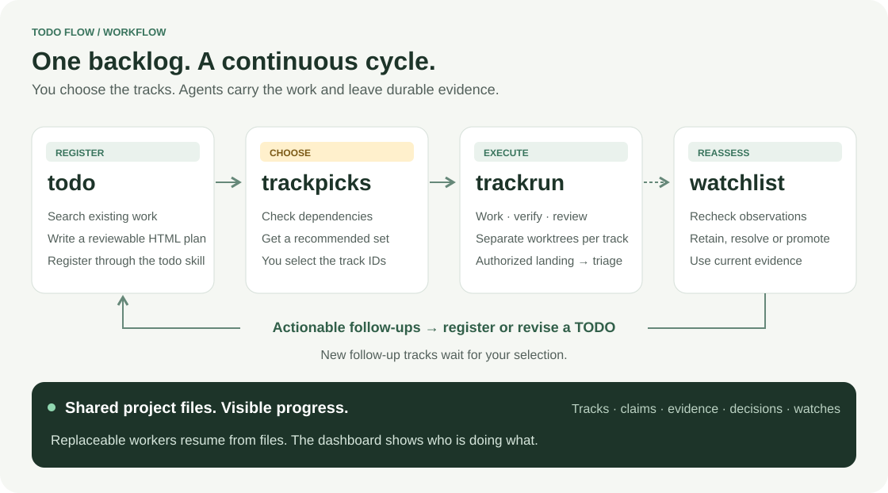

# TODO Flow

**Pick the work. Let agents carry it forward.**

Turn selected TODOs into parallel work, independent reviews and verified delivery—with files that survive the session and a dashboard that shows who is doing what.

**English** · [한국어](README.ko.md)

[Get started](#quick-start) · [See it in action](#see-it-in-action) · [For agents](#for-agents) · [Operations](OPERATIONS.md)

[](LICENSE) [](#current-scope) [](pyproject.toml)

## TODO Flow in 32 seconds

https://github.com/user-attachments/assets/6c62d429-2fbc-40b5-a31e-b530e5d1ada3

*Animated workflow overview: track selection, parallel agents, session handoffs, verification, review and landing.*

## Development activity, up to 33×.


**Register. Pick. Run.** You set the direction; replaceable agents carry out investigation, implementation, verification and review, then landing and triage when authorized.

<sub>Anonymous predecessor workflow: daily commits increased from 9.3 in January to 316.3 in September 2026 (September 1–23). Commit activity, not a measured multiplier of labor productivity or a benchmark of this package.</sub>

<details>
<summary>January–September growth and measurement notes</summary>


Adjusted source changes per day increased **4.52× from June to September**; recorded completion transitions per day increased **2.30× from July to September**. Different metrics describe different outcomes: January–September source changes rose 1.09×, and September completion transitions were lower than August.


[Method and monthly figures](assets/metrics/README.md) · [Aggregate JSON](assets/metrics/measurements.json) · [CSV](assets/metrics/monthly.csv). These are observations from predecessor operations, not a controlled causal experiment. Identifying source material is not published.

</details>

## The workflow cycle



**`todo` → `trackpicks` → `trackrun` → `watchlist` → `todo`.** Register a reviewable plan, choose the work, execute selected tracks, and reassess what needs attention. You can also select tracks directly in the dashboard. Only tracks eligible for a new execution request have enabled checkboxes. Tracks marked **Requested**, **Paused**, or **Pause requested** cannot be selected again. Open a track title to inspect its details; use **Resume** there to continue paused work. `trackpicks` recommends work; it does not start workers.

`trackrun` stops at review by default. With landing authorized, it continues through landing and triage, including reassessment of that track's open watches. Use `watchlist` for explicit reassessment; actionable findings return to an existing or new TODO. New follow-up tracks await your selection. These are entry points into shared project state, not mandatory phases for every track.

## See it in action

**We have started applying TODO Flow to this repository.** See the [actual setup, dashboard capture and reproducible configuration](examples/self-hosting/README.md). The initial snapshot has no registered tracks yet; execution results will be documented as real work runs.


*Captured from the real dashboard with explicitly labeled synthetic data. This UI tour does not represent a live model run.*

[Dashboard screenshot](assets/demo/dashboard-en.png) · [한국어 dashboard](assets/demo/dashboard-ko.png) · [Reproduce the demo](DEMO.md) · [Plan preview](assets/demo/track-example.png) · [Example HTML](examples/retry-backoff.html) · [Real issue → merged PR](DEMO.md#inspect-a-previous-public-acceptance-run)

The tour shows a dense, continuous TODO list, selection for `trackrun`, current workers and decision waits, a rich track document, and a separate completed archive. For the full execution path, follow the [two-track walkthrough](DEMO.md#run-the-full-workflow) or run the documented live acceptance test in a disposable project.

## Built for work that outlives a chat

| What you need | What TODO Flow provides |
|---|---|
| Move several tasks forward | Selected tracks run in separate Git worktrees; workers take bounded pieces of work. |
| Recover after a session ends | Documents, claims, results, questions and follow-up intent stay in searchable files. |
| Review the plan before execution | HTML documents preserve diagrams, images, scripts and simulations. Markdown also renders to HTML. |
| Know who is doing what | A compact dashboard shows current work, owners, waits and evidence. Completed work has its own archive. |
| Deliver with evidence | Exact-candidate verification, independent agent review, authorized landing and post-landing triage. |

Useful for a backlog of independent changes, work that spans sessions, and reviewing several candidate changes before integration. On the development branch, workers receive workspace and evidence paths, then search and read relevant files themselves. See [current scope](#current-scope) for release availability and remaining boundaries.

## Quick start

Choose **English (`en`) or Korean (`ko`) during project setup**. This sets the project's default dashboard language and the language requested from agents for reports and new track documents. Skill instructions remain English. The dashboard also has an English / 한국어 switch for your personal display preference.

### Let your agent set it up

Paste this into your coding-agent session, filling in the project and first task:

```text
Install TODO Flow in /absolute/my-project following
https://github.com/JakeB-5/todo-flow/blob/main/AGENT_INSTALL.md. Ask me to choose English or Korean if I have not specified it.
My first task is: [the change and expected result].
Register a reviewable HTML TODO and show me its link. Select and run the
track that covers this request, then report the actual result and next steps.
```

[For agents](#for-agents) explains the installation contract. Setup-only requests stop after setup; the prompt above also requests the first run.

### Install manually

Prerequisites: **Python 3.11+, uv, Git, and an authenticated Claude or Codex CLI**. GitHub issues and PRs additionally need authenticated `gh`. Install the published release:

```sh
uv tool install https://github.com/JakeB-5/todo-flow/releases/download/v0.0.4/todo_flow-0.0.4-py3-none-any.whl
todo-flow --version
```

[Release assets and checksums](https://github.com/JakeB-5/todo-flow/releases/tag/v0.0.4). This installs the CLI and bundled dashboard/skills; no checkout is needed. For source development, clone this repository and use `uv sync --frozen` and `uv tool install .`.

In the **target project**, use its real verification command, base branch and relevant file patterns. This example assumes an existing Python project with a test suite, an initial Git commit and an `origin` remote:

```sh
cd /absolute/my-project
todo-flow init --repo . --base main --worker codex \
  --language en \
  --verify '["python3","-m","unittest","discover","-v"]' \
  --write 'src/*.py' --write 'tests/*.py' \
  --context 'src/*.py' --context 'tests/*.py' --context README.md

todo-flow install-skills --target .agents/skills
todo-flow serve --port 8765
```

Use `--language ko` for Korean. Omitting it prompts in an interactive terminal and defaults to English without a terminal. For Claude sessions, install to `.claude/skills`. Skills inherit the configured language. Add `--github OWNER/REPOSITORY` to `init` for GitHub issues and PRs.

Open **http://127.0.0.1:8765**. Ask your agent to use the installed todo skill, review the generated document, then select and run its actual ID. Setup is complete when the dashboard opens, the registered document renders and the requested first run reaches its configured endpoint. [Detailed setup and recovery](AGENT_INSTALL.md).

## From the first TODO to a result

In your agent session:

```text
todo Add bounded retries for temporary network failures, with tests.
todo Show a useful error when a request cannot be retried.
trackpicks
```

The agent searches existing files for overlap and registers HTML plans. Review them in the dashboard. Pick tracks there and copy the command, or use the recommendations from `trackpicks`:

```sh
trackrun retry-backoff request-error-message
```

*These are example IDs; use the IDs returned by your own registration.* `todo` and `trackpicks` are agent skill requests; `trackrun` is also an installed terminal command.

| Step | What you can inspect |
|---|---|
| Register and review | The HTML plan, scope, evidence and acceptance conditions. [Example](examples/retry-backoff.html) |
| Select and execute | Selected IDs, separate worktrees, current workers and questions. |
| Verify and review | Verification output and independent review tied to the exact candidate. |
| Land and triage | With an authorized landing endpoint: integrated SHA, finding dispositions, issue closure and completion. |

The default endpoint is **`review`**, which preserves a reviewed candidate. To authorize automatic landing during initialization, add **`--endpoint land --allow-land`**. After landing, triage handles original-scope repairs, separate follow-ups and conditional watches. New follow-up TODOs await your selection.

## For agents

Read **[AGENT_INSTALL.md](AGENT_INSTALL.md)** and perform the requested installation and first-run scope. Reuse existing configuration and authorization. **Ask for the primary language if it was not specified; persist it with `init --language en|ko` and use it for new documents and reports.** Do not infer language solely from the English README.

[Agent setup](AGENT_INSTALL.md) covers project discovery, authentication, language selection, skill installation, document review, execution and evidence-based handoff. [Skills](skills/) contain the task-specific instructions.

## How it fits together

```text
Your selection ── trackrun ── bounded, replaceable workers
                                ↕
                   Project files: goals, work, evidence
                                ↓
                  verify → review → authorized landing
                                ↓
                         triage → completion

Dashboard reads the same project state throughout.
```

One installed engine serves multiple projects. Each project has its own configuration, files, worktrees, installed skills and running dashboard/driver processes. Workers propose useful next work; the host validates ownership, evidence and external effects. There is no fixed global phase sequence or resident supervisor agent.

| Component | Support |
|---|---|
| Worker adapters | Claude CLI and Codex CLI; trusted command adapter for integrations/tests |
| Remote delivery | Git remote, optionally GitHub issues / PRs through `gh` |
| Project state | HTML / Markdown / JSON files; SQLite is only a rebuildable query cache |
| Language | English / Korean project preference and dashboard UI |
| Environment | Local macOS validation; Linux checks configured in CI. Windows is not supported by the current POSIX process/locking implementation. |

## Updates

```sh
todo-flow --version
todo-flow --state /absolute/project/todo compatibility --target /absolute/project/.agents/skills
```

For an installed uv tool, `todo-flow upgrade --wheel /absolute/new-release.whl --dry-run` plans an engine update; omit `--dry-run` to apply it while all drivers and dashboards are stopped. The updater checks known project formats, backs up the environment and restores it if installation or validation fails. Supply a trusted newer release wheel; automatic release discovery is not yet provided.

Then use `todo-flow --state STATE update-skills --target PATH --dry-run` for each project and apply without `--dry-run`. Local edits and language/state bindings are preserved; conflicting changes stop before any file is replaced. Engine and skill updates return separate rollback IDs.

[Update, rollback and recovery guide](UPDATES.md) includes interrupted-update recovery, legacy skill adoption, tested boundaries and the future release checklist.

## FAQ

**Does this replace my coding agent?** It coordinates selected work using your authenticated Claude or Codex CLI. You keep your model and project configuration.

**Where is the data? Is there a shared database?** Each project owns its `todo/` directory, or an explicit `--state` directory. Use `rg` to inspect it. No shared server or database service is required.

**What happens when a session or driver stops?** Restart `todo-flow --state STATE run` against the same files. The runtime reconciles claims and recorded effects. A stopped process is not reported as completion.

**Will it merge automatically?** The default is review-only. An initialized `land` endpoint with `allow_land` permits landing, followed by triage and completion checks. Existing branch protection still applies.

**How many tracks can I select?** Pass multiple IDs to `trackrun`. `--jobs` limits concurrent tasks for that driver (default: 2); it is not the number of selected tracks or a guarantee of a dedicated worker per track.

**What does it cost?** TODO Flow is MIT licensed. Model usage and any external services follow your existing provider accounts and billing. Parallel work can increase model usage.

**Can I change language without changing the project?** Yes. The dashboard switch remembers a display preference for this project in this browser. It does not translate existing authored documents or change the agents' configured primary language.

**Do I need Jev?** No. The todo and watchlist skills recommend Jev for optional investigation/overlap/changed-source screening. They proceed without it; TODO Flow does not bundle or automatically install a Jev integration.

## Current scope

**New in 0.0.4:** proposal commits preserve unrelated staged changes, verification and review check a clean checkout at the exact candidate commit, and timed-out verification stops its process group before more work proceeds. See [execution boundaries](OPERATIONS.md#review-landing-and-completion).

**New in 0.0.3:** integration repairs merge the current base into the candidate checkout, expose conflict evidence by path and require new verification and independent review before landing. Interrupted repairs and decision answers retain the recorded merge. See [repair behavior](OPERATIONS.md#review-landing-and-completion).

**New in 0.0.2:** workers read project files on demand, and `trackrun` prefers visible terminal logs through Orca, a configured terminal launcher or tmux. No available terminal means headless execution; `--launcher headless` explicitly selects it. The published `0.0.1` wheel still uses the earlier snapshot/headless implementation. See [worker execution](OPERATIONS.md#worker-context-and-terminal-launchers).

Completed tracks automatically clean disposable checkouts and unchanged worker terminals while retaining documents, logs, results and Git branches. Resources with user changes or unconfirmed ownership are kept with a reason. Use `--no-auto-cleanup` to retain resources for inspection; see [cleanup and retry](OPERATIONS.md#cleanup-migration-and-hooks).

Latest release: **0.0.4**. Small-project full cycles, recovery and two–three independent concurrent tracks have been exercised; large lists have separate synthetic UI coverage.

- One repository per project state. Forgejo, submodules and coordinated multi-repository landing are not implemented.
- Development workers explore the checkout with read-only tools and return JSON proposals. The runtime applies changes, verifies and publishes. Browser workflows are not implemented.
- Source contents and full evidence are not injected into the prompt; there is no aggregate 150,000-byte source limit on `main`. Provider context limits still apply to what a worker chooses to read. File deletion and binary edits are not supported.
- Default worker timeout: 600 seconds. Default driver task-assignment limit: 100; remaining requests survive for the next run.
- No shared slot budget across drivers, separate heavy-verification queue or validated distributed-filesystem operation.

## Documentation and contributing

[Updates and rollback](UPDATES.md) · [Operations and recovery](OPERATIONS.md) · [Demo and acceptance test](DEMO.md) · [Contributing](CONTRIBUTING.md) · [Changelog](CHANGELOG.md) · [Agent repository rules](AGENTS.md) · [CI configuration](.github/workflows/ci.yml)

Report bugs or propose improvements through repository Issues; include a minimal public-safe reproduction. Contribution and local validation commands are in [CONTRIBUTING.md](CONTRIBUTING.md). Local design notes in `docs/` are ignored and are not required to use or build the project.

**[MIT License](LICENSE)** · Copyright © 2026 TODO Flow contributors.
