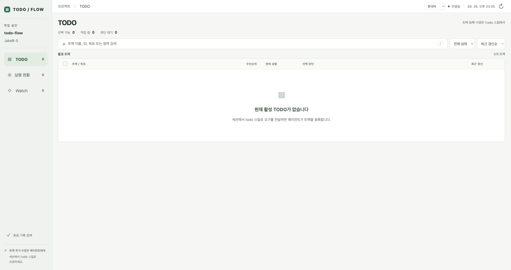

# Managing TODO Flow with TODO Flow

[Project README](../../README.md) · [Demo](../../DEMO.md) · [Installation](../../AGENT_INSTALL.md)

On September 26, 2026, we initialized this repository as a TODO Flow project. A separately installed release manages the development checkout. This page records the real setup and provides a way to reproduce it.

**Status at capture: setup verified; 0 registered tracks, 0 running tasks, 0 completed tracks.** No development task in this repository had been executed through this installation yet. The setup and this write-up were prepared in an interactive agent session. Earlier full-cycle acceptance runs used [separate disposable repositories](../../DEMO.md#inspect-a-previous-public-acceptance-run).



*Actual application capture from this repository's local dashboard. No synthetic tracks or execution results were added. The empty list is the starting point for future work.*

## What we configured

| Setting | Actual setup |
|---|---|
| Engine | Published `0.0.4` wheel, SHA-256 checked, installed with `uv tool` |
| Managed repository / base | `JakeB-5/todo-flow` / `main` |
| Primary language | Korean (`ko`); shared project documentation remains English-first |
| Worker | Authenticated Codex CLI, its configured default model |
| Worker launcher | `auto`, with a running Orca project available |
| Endpoint | `review`; automatic landing disabled |
| State | Checkout-local `todo/`, excluded from Git |
| Operational skills | Release copies in `.todo-flow/skills`, linked from `.agents/skills` |
| Development skills | Source files remain in `skills/` |
| Verification | Python suite, Ruff lint/format, JavaScript syntax, localization tests, package build |
| Verification timeout | 900 seconds; the setup suite took about 258 seconds |

Setup verification passed **123 Python tests, 6 localization tests, lint, formatting, JavaScript syntax and package build** at source commit `490b874c71aba4dbf1a5d32008e34af71603bf7d`. Engine/project/skill compatibility checks passed. The browser showed this repository, Korean UI, a connected dashboard and an empty backlog. This verifies setup; the first real track will provide execution evidence.

## Reproduce the setup

Use [AGENT_INSTALL.md](../../AGENT_INSTALL.md) for prerequisites, authentication and existing-installation checks. Install the published `0.0.4` engine separately from the checkout; keep using the installed `todo-flow` / `trackrun` commands for operation. `uv run trackrun` loads development code and is unsuitable for this separation.

The [verification runner](verify.py) reproduces the commands used during setup. It runs against its **current working directory**, so a candidate worktree tests its own source and virtual environment. Keep a local copy outside candidate edits:

```sh
# From the TODO Flow checkout, before initializing new project state:
mkdir -p .todo-flow
cp examples/self-hosting/verify.py .todo-flow/verify.py
python3 .todo-flow/verify.py
```

For a fresh checkout, this example initializes a starting source/test/document scope. Expand the explicit write patterns for the work you intend to select. Reuse existing state instead of rerunning initialization.

```sh
todo-flow --state "$PWD/todo" init \
  --repo "$PWD" --base main --worker codex --language ko \
  --endpoint review --launcher auto --verify-timeout 900 \
  --verify "$(python3 -c 'import json, pathlib, sys; print(json.dumps([sys.executable, str(pathlib.Path(".todo-flow/verify.py").resolve())]))')" \
  --write 'src/todo_flow/*.py' --write 'src/todo_flow/web/*' \
  --write 'tests/*.py' --write 'tests/*.cjs' \
  --write 'scripts/*.py' --write 'skills/*' \
  --write README.md --write README.ko.md --write DEMO.md \
  --context 'src/todo_flow/*' --context 'tests/*' \
  --context 'skills/*' --context AGENTS.md

todo-flow --state "$PWD/todo" install-skills --target "$PWD/.todo-flow/skills"
```

Our installation also configured the actual GitHub remote with `--github JakeB-5/todo-flow`. In a fork, use your own remote if you want issue/PR integration. Omit that option to leave GitHub integration unconfigured.

In a fresh clone whose `.agents/skills` is still the original `../skills` symlink, preserve that link and connect the operational copy. Inspect existing skills first; do not replace a customized installation:

```sh
python3 - <<'PY'
from pathlib import Path
link = Path(".agents/skills")
backup = Path(".agents/skills.source-link")
assert link.is_symlink() and link.readlink() == Path("../skills")
assert not backup.exists() and not backup.is_symlink()
assert Path(".todo-flow/skills/todo/project.json").is_file()
link.rename(backup)
link.symlink_to("../.todo-flow/skills", target_is_directory=True)
PY

todo-flow --state "$PWD/todo" compatibility --target "$PWD/.todo-flow/skills"
todo-flow --state "$PWD/todo" serve --port 8766
```

Keep the dashboard in a persistent terminal. Choose a free port; our usual port was already occupied. A newly opened agent session discovers the installed project skills. Preserve the repository's tracked development symlink in published commits; the operational link is a local checkout customization.

## Declare verification inputs with a supporting engine

The setup above records the published `0.0.4` installation. The source implementation adds `init --verify-identity`; do not assume the published wheel supports it. Check the installed engine's `init --help` before using this option. The following is an optional declaration for **new state**, not a claim that the historical setup used it or an instruction to reinitialize existing state.

When initializing new state with a supporting engine, add this option to the existing `init` command, keeping its verification command and review endpoint:

```sh
--verify-identity "$(python3 -c 'import json, pathlib, sys; print(json.dumps({"version": 1, "files": [str(pathlib.Path(".todo-flow/verify.py").resolve()), str(pathlib.Path(sys.executable).resolve()), "uv.lock"], "environment": ["PATH", "UV_INDEX_URL"], "nonce": "runner-baseline-1"}))')"
```

This is a command continuation argument, not a standalone shell command. Choose environment names for the actual runner; the example list is not an exhaustive dependency inventory.

`version` must be `1`. `files` lists individual regular files, not globs or directories. Relative names such as `uv.lock` resolve against the candidate verification workspace. Absolute names identify external files such as the protected runner and interpreter. Missing or unreadable declared inputs prevent accepting cached success. Declare additional external configuration and input files that affect your checks.

Keep the external runner outside candidate write permissions and pin the interpreter, tool versions and dependencies used by it. A stable pathname alone does not pin content. Declaring the runner detects its replacement; it does not automatically identify imported modules, subprocess executables or the contents of a virtual environment. A lockfile records intended dependencies, not proof that the installed environment matches it. Use your normal locked installation process and controlled tool environment as well.

`environment` contains variable **names**, never assignments or secret values. The verifier receives a captured environment, and identity evidence records selected names and digests; unset and empty values differ. The host forces `GIT_TERMINAL_PROMPT=0`. The identity mechanism does not store selected environment values in plaintext. Digests are not password protection: low-entropy values may be guessed. Verification output is stored separately and can expose values printed by a runner. Keep secrets out of command arguments, nonce text and output.

`nonce` is an operator-selected invalidation label. A changed nonce makes prior identity evidence unusable even when the command and files match. It is stored in configuration as text and hashed in identity evidence, so use a non-secret label. **Existing project configuration is currently immutable through `Store.configure`, and there is no configuration-update CLI.** Repeating `init` cannot rotate the nonce or add declarations to existing state. Choose declarations and the nonce during new-state initialization; do not edit canonical state or delete it to bypass this restriction. An existing installation needs a separately supported configuration migration before it can adopt a different declaration. For an already declared external input, an intentional content change also invalidates its previous identity without changing the declaration.

Reuse additionally requires the same HEAD, tree, command, timeout and a clean checkout. Identity-free legacy success must be verified again; unknown identity versions are rejected. Before and after execution, declared files are observed using content digests, resolved paths and filesystem metadata. Ordinary replacement, modification and removal are detected, including ordinary change-and-restore writes whose metadata changes. This is not execution from an immutable snapshot or protection against privileged metadata manipulation. Undeclared files, transitive dependencies, undeclared environment variables and remote services are not inferred. Pin those dependencies or explicitly declare the inputs that can represent them; an unchanged declared identity cannot prove an unchanged remote service.

## Use it for the next real requirement

1. Ask the agent: `todo <a concrete change and its expected result>`.
2. Open the registered HTML plan in the dashboard and inspect its scope and acceptance conditions.
3. Select work yourself, optionally using `trackpicks` recommendations.
4. Run `trackrun ACTUAL_TRACK_ID` with the installed release command.
5. Inspect verification and independent review for the exact candidate. This setup stops at review; merging requires separate authorization.

These are the next steps, not a claim that a first track has run. When publishing that first case, include the real requirement, a reviewed public copy of its plan, exact candidate and review outcome, and any issue/PR links. Record interruptions or manual recovery alongside the result. Add landing and triage evidence only when those actions actually happen.

## What belongs in Git

| Publish after inspection | Keep local |
|---|---|
| This walkthrough and portable verification recipe | `todo/` canonical execution state and query cache |
| Application screenshots with an accurate status caption | Raw agent transcripts, prompts and terminal receipts |
| Deliberately selected plan/evidence excerpts and public issue/PR links | Machine-specific configuration, paths, process IDs and credentials |
| Source code and the development skills | `.todo-flow/` engine artifacts, installed skills and local setup records |

The `.gitignore` rules protect the default local state. Track documents remain authoritative in `todo/`; a public example is an inspected snapshot, not a second execution store. GitHub does not host the live local dashboard. Stop drivers and dashboards before changing the operational engine or skills, following [UPDATES.md](../../UPDATES.md).
